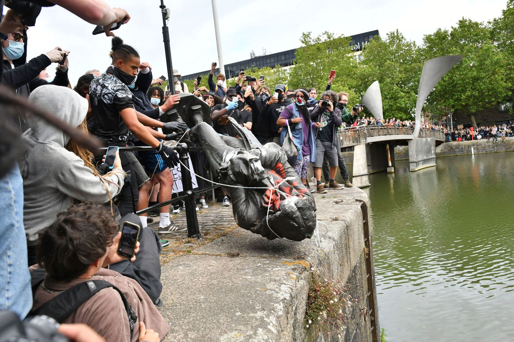

Newton’s Third Law of Motion states that for every action in nature there is an equal and opposite reaction. This scientific concept applies to people as well. Through their actions, anyone has the potential to create tales of glory or notoriety, whether they intend to do so or not. George Floyd, known as “Big Floyd” by friends, moved to Minneapolis to find work in 2014. He was killed on May 25, 2020. An independent autopsy found that Floyd died of “asphyxiation from sustained pressure” on his neck and back by Minneapolis police officers during his arrest. His murder at the hands of police officers was the veritable spark that ignited the disillusioned masses into action.

Millions across America took to the streets to demand an end to discrimination. Demonstrators in multiple states toppled several statues of Confederate figures such as Williams Carter Wickham and Robert E. Lee, calling for the past to be untainted by a confederate narrative. Several police departments across the country have also shown their solidarity with protesters. Sheriff Chris Swanson was one of the officers who did so. The photo of the Genesee County police officer, taking off his helmet and laying down his baton to walk with protesters inspired many others in America and around the globe.

Rage at George Floyd’s death was not limited to Americans. George Floyd, an ordinary man from the Midwest, became a global household name within hours of his brutal murder. From London and Paris to Pretoria and Sydney, masses of people defied COVID-19 related government guidance to show solidarity for the black community. Like their counterparts in America, many toppled statues of historical figures in their own respective countries and demanded the record show their racism.

Some protests have taken a dark turn. Numerous businesses across the nation have been severely damaged. Several private business owners have had their livelihoods destroyed; for some, their small, burnt down stores made up most of their wealth. Many point out that it is a moral contradiction to protest the death of an innocent person by destroying the lives of other innocent people. Even Terrance Floyd, George Floyd’s brother, condemned violent protests and called for protesters to be more peaceful saying, “if \[George Floyd’s] own family and blood are trying to deal with it and be positive about it, and go another route to seek justice, then why are you out here tearing up your community?”

Despite the violence, however, the majority of protests remain peaceful according to the US Crisis Monitor. Peaceful protesters believe that their demands for change will be taken seriously only through their actions. Indeed, several police departments have promised to undertake significant reforms. The Minneapolis City Council pledged to dismantle the police and bring about a “transformative new model of public safety”. They plan to replace the police force with a new department of “community safety and violence prevention”. New York City also acquiesced; the mayor, Bill de Blasio, pledged to redirect a portion of the police department’s budget toward youth and social services. He hopes that investing in the city’s people will decrease crime and police brutality. He also called for disciplinary records of police officers to be made public to build “trust between police and \[the] community.”

There are lingering doubts as to whether all of these reforms will prove effective. Many point out that defunding the police may simultaneously increase police brutality and crime rates. This is because an underfunded police force will be under-trained. Such a force is unlikely to be capable of producing skilled police officers who demonstrate restraint, while also being ineffective at deterring crime.

Despite some shortcomings, after decades of officials offering only empty platitudes, the newly found enthusiasm for police reform is welcome. This effort is only a part of the broader changes that need to be undertaken; much is still yet to be done to combat discrimination. Equality of opportunity does not exist for everybody in the US. Black and Hispanic communities are more impoverished on average than their white or Asian counterparts. Social media has increased hate speech against minority groups and marginalized them even further. Some American politicians even make openly racist comments against minority groups. It is clear that the fight against racism will be a long-term effort. Elected officials should not wait for pressure from their constituents to address inequality and racial injustice. Innocent, men and women should never need to die; we should heed their anguished cries of desperation and stand shoulder-to-shoulder with them in their struggle to secure equality in all aspects of life.