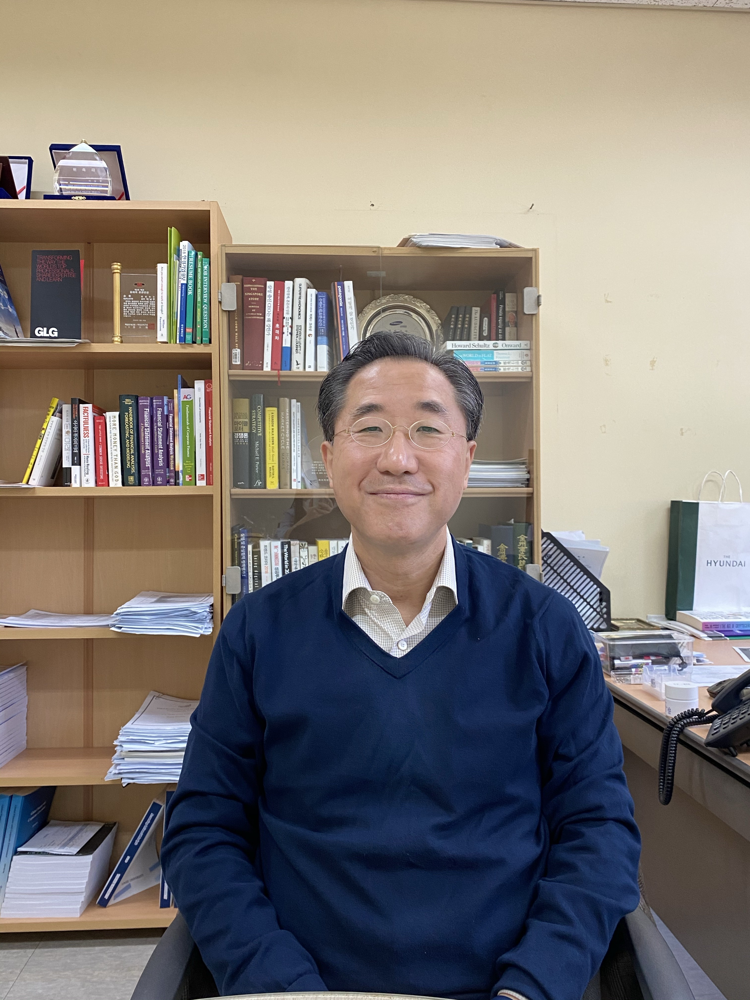

<!--StartFragment-->

Professor Namuh Rhee joined Yonsei’s Graduate School of International Studies (GSIS) in 2016 as Visiting Professor and Senior Advisor at the Career Development Center. He teaches three courses at Yonsei: two at Underwood International College and one at GSIS. Prior to joining Yonsei, Professor Rhee enjoyed a successful banking career spanning nearly 30 years. Most notably, he was Managing Director and Head of Asia Account Management at Nomura International, Managing Director and Co-Head of Merrill Lynch Korea, President and CIO of Rhee Capital, Managing Director at Samsung Securities, and Vice President of J.P Morgan Hong Kong. In this interview with the UIC Scribe, he discusses career advice, personal lessons, and his new best-selling book, Good Stock Bad Stock.

**Q. You have been called “one of the most influential financial analysts in Asia.” What do you think are some personal traits of yours (or in general) that are conducive to a successful career in this field?**

For starters, I was fortunate to have joined the investment banking scene when Korea had just opened its market to international players. As for personal traits, I believe that there are three characteristics necessary for a successful career in banking and investment. First, you need a solid background in financial analysis. Take relevant courses at both UIC and the business school, read high quality journals, and subscribe to at least one newspaper. I myself read five everyday: The Financial Times, The Wall Street Journal, The Economist, Chosun Ilbo, and Korea Economic Daily. Second, you must have perseverance, which is something you learn throughout your career. A great way for students to cultivate perseverance is to experience a couple of internships — maybe one at a start-up, one in the public sector, and one at a private company. Reach out to your mentors and ask for both formal and informal feedback. Lastly, you must have a positive attitude. Amidst uncertainty and incomplete information, it is paramount that you believe in yourself and focus on executing your tasks well. I think that these three traits are relevant for any and every industry, whether it be consulting, law, or accounting.

**Q. Do the traits that molded you into an esteemed analyst transfer well into your current position at Yonsei? What are some key differences between the two?**

I never thought that I would end up teaching. My job as an analyst required that I hone my analytical skills and maintain high standards, both of which are useful in education. I would say that contrary to many tenured professors that teach basic theory and concept, I try to apply those theories to the real world in my classes. Thankfully, many students have told me that my courses have proved handy at internships and even at jobs.

**Q. In your recent book, Good Stock Bad Stock, you divulge everything a beginning investor needs to know. Here, you maintain that one of the criteria in assessing the worth of a company’s stock is the competence of its management. To students studying investment on their own, what are some signs of competent executives?**

There are good and bad companies, which are each divided into good and bad stocks. In classifying these categories, it is crucial to assess factors such as company fundamentals, moat, product differentiation, and good governance. For long-term investors, the quality of management is especially important to consider. Students can refer to investment reports (Form 10-K in the US, DART in Korea), which disclose key information about management figures. Look at both the education and professional development of company executives and research their business performance, stock performance, and specific roles.

**Q. Are there any other projects you would like to pursue during this “COVID era”?**

I think that this is an interesting time for Korea. So many people are starting to invest and this may lead to the emergence of an equity culture. Yet we will have to wait and see, as based on my interaction with students, it seems that people are trading too often and too short. I am interested in continuing to educate the public through the Korean Corporate Governance Forum, an organization that aims to improve domestic corporate governance standards. We will most likely be communicating through YouTube.

**Q. Do you have any advice for UIC students that wish to join the international finance scene like you?**

Whether you join the banking scene or global market scene, you absolutely must have a solid background in financial accounting. For students interested in gaining more systematic training, I suggest studying for the Chartered Financial Analyst (CFA) exam. Remember to read leading journals religiously and spend at least 60 minutes every day mulling over key, timely topics.

<!--EndFragment-->