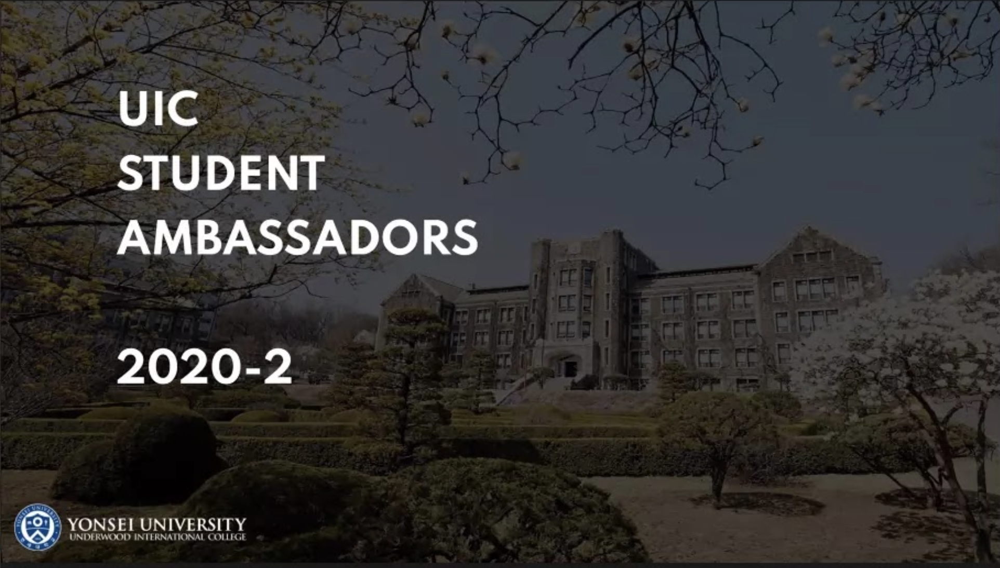

The UIC Student Ambassadors is a student-led organization on the fore of Underwood International College’s promotional efforts. Founded in 2011, the Student Ambassadors collaborate with the UIC office to promote the college to prospective students. They maintain the college’s official Facebook and Instagram pages, posting about pertinent events both inside and outside the school such as celebrating Yonsei alumni, news on campus events, promoting special contests and forums, advice on campus life, and highlighting members of UIC.

I had the privilege of talking with Do Minh Hanh, Secretary of the UIC Student Ambassadors 2020.

**Q. How is the UIC Student Ambassadors organized?**

A. Right now we are dividing the members into 2 groups journalists (mainly on Facebook) and editors/photographers (Instagram). The board has 3 members, and we work closely with the PR officers on budgeting and advertisements.

**Q. How do you decide the content for UIC’s social media presence?**

A. Although we do not have our own platforms, we are behind the UIC pages that people might know on FB and Instagram. We decide the contents based on the posts contributed by our members. We come up with major themes for each week or 2 weeks, and our members write posts based on their own experiences at UIC. For the pictures, we mostly use those we take whenever we spend time on campus, and we also assign our designers to take pictures of their lives here, too.

**Q. What are some notable PR efforts the Student Ambassadors have made in 2020?**

A. We have raised our Instagram account to almost 4000 followers within this year as the current board. We also created Tumblr and LinkedIn profiles for UIC Student Ambassadors, and hopefully we can maintain these platforms in the future. Inside SAM’s club, we managed to organize one workshop last semester on digital PR for our members. We are hoping to organize two workshops this semester, one of which has been done so far.

**Q. What are the biggest challenges that come with putting Underwood International College on the map?**

A. I can only speak in terms of social media channels since that is our main objective. I would say that the biggest challenge is to raise interaction with Korean prospective students, I guess that is mainly because they have other channels available in their native language. Also, our Facebook audience is no longer as active as it was 3-5 years ago, so we have not really increased many likes on this platform yet.\
**Q. Social media has allowed an unprecedented number of connections between language and cultural barriers. How would you appraise the progress in modern Korea’s marketing itself to the world?**

A. I think Korea is doing very well in marketing their own culture, especially music, worldwide.

I cannot speak for everyone, but most UIC international students already come here with more or less a substantial wealth of knowledge and expectations of Korean culture. I am not sure about the sources from which they get their information, but based on my friends’ experiences I would say music shows and concerts are good sources of publicity. Korean tourism, or just living in Korea in general, is quite foreigner-friendly. English explanations are provided at a lot of tourist attractions, public transportation, restaurants, etc. The young generation is much better at English too, so communication is not much of a problem. If I could extend any advice on those in Korea willing to market themselves worldwide, it would be for them to share the beauty of Korean scenery. Besides Korea’s pop culture, foreigners might not know about Korea’s tourist attractions or its scenic, photogenic nature. Korea to me is a balance between modern culture and tradition, so if people can upload beautiful pictures with engaging content, it will appeal to the international community.

**Q. What are some crucial things students who want to join SAM should know?**

A. I think we expect students to represent UIC not only online but offline as well, so we always see if they could keep a positive attitude towards our college and be a bit careful about their social media presence.

Listening to the way the UIC Student Ambassadors operate was an important insight into UIC’s public relations management and the aspects in which student-office collaborations would be applicable. With social media remaining a convenient and cost-effective method of managing news and public relations, I feel it is important that the Student Ambassadors continue to be a vital part of the college’s PR as an avenue for student participation.