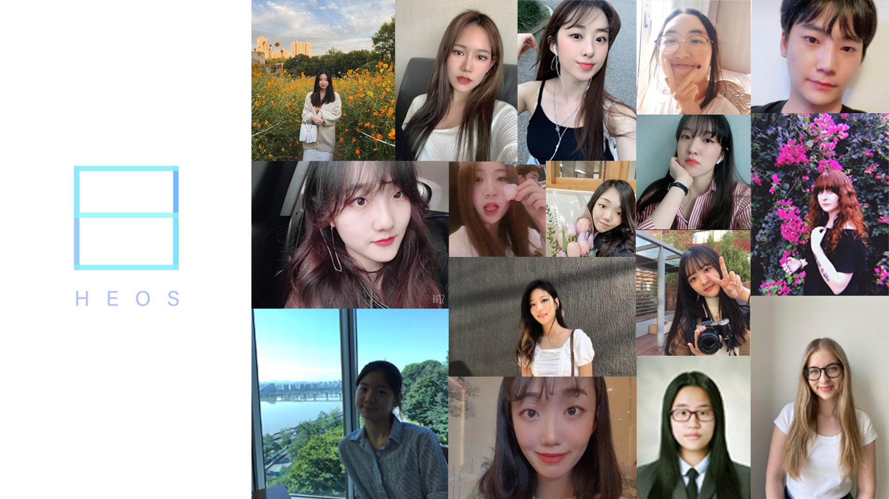

This year, Underwood International College (UIC) welcomed a new member into its diverse community of student-led clubs: HEOS. It is an official Cultural and Design Management (CDM) Major Club where its members can experience culture and art management by carrying out team projects based on unique reinterpretations of a given topic. The name “HEOS” stands for “Highlight your artistic sense, Enjoy what you love, Opportunity for your Specialty to shine,” and its vision is to create an opportunity for like-minded people to release their ideas and fulfill their dreams. At HEOS, anyone can experience the diverse fields of culture and art industry.

To learn more about this new, ambitious club, I interviewed its two leaders: the Creative Director Seo Hyeon Chung (CDM Major, entering class of 2019) and the Head Director Chae Rim Jeong (CDM Major, entering class of 2019).

**Q. Could you tell us about your motives for creating the club, HEOS?**

**Chae Rim:** Seo Hyeon and I were in the same class last year, and we had both decided to choose our majors as CDM. When we started talking about our future, we felt that it is difficult for HASS freshmen to actually learn about our major before entering into it. The field of design is especially hard to approach, and first years often have only a vague idea of what CDM is. So we wanted to create a no-pressure opportunity for students to experience Cultural and Design Management. We hoped to strengthen the identity of CDM for prospective students and to expand opportunities to gain experience in the art industry.

**Q. Could you explain the project that HEOS did in the first semester?**

**Seo Hyeon:** At the beginning of each semester, we choose a topic, which was “Distance” last semester. Members then each conduct individual reinterpretation of the topic and bring their own project proposals. At the orientation, we pick 3-4 proposals out of them and create teams to carry out the projects. Last semester, we had four teams. The first team interpreted distance as “distance between space,” which went along with how we are all socially/physically distanced from one another during the COVID-19 pandemic. The second team interpreted it as “distance between time,” and filmed a video of the change of style from the 80’s to now. The third team expressed different emotions in photographs as varying colors, based on their idea of “distance between emotion.” The fourth team worked on “distance between fashion,” and they showed the evolution of fashion focusing on a model.

**Q. What do you think are the advantages of HEOS being a UIC club?**

**Seo Hyeon:** I think our biggest advantage is diversity. Because our projects are based on different reinterpretations of a theme, diversity is very important. When we do the ideation process, each member brings surprisingly different views of the same keyword. People from different cultural backgrounds all have various ideas for a topic, and as a result, we are able to produce artworks that international audiences can empathize with and enjoy.

**Q. 2020 was a difficult year, with the unexpected Covid-19 pandemic. How did you cope with the situation?**

**Chae Rim:** There were actually many hardships. In fact, we had to completely change the club’s direction. HEOS had originally intended to hold an offline art exhibition where members would show off their artworks. However, with the Covid-19 situation, we could only do an online exhibition. Over the summer, we thought of ways to deal with Covid-19 in the long-run and decided to transition HEOS into a project-based organization, rather than an exhibition-based one. Now, we feel that this new direction fits better with our values and goals. Plus, we were able to discover a very useful online platform for team communication, called Miro.

**Q. Lastly, who would you recommend to join HEOS?**

**Seo Hyeon:** I would recommend HEOS for students who want to realize their dreams. I created HEOS because I wanted to actualize artworks that I had only had in my head. HEOS is going to be the chance to materialize the dreams you have in your mind.

**Chae Rim:** After choosing CDM as my major, I felt that extracurricular design competitions and activities were for people who already had enough knowledge and skills. So I wanted to create a “pre-step” for people who were like me, who were entering this field for the first time. I would recommend HEOS to any freshmen who are interested in joining CDM, or students from other majors who want to immerse themselves in culture and design.

\*If you want to find out more about HEOS and its activities, you can check out their [website](https://uicheos.wixsite.com/heos2020) or their Instagram account @heos.yonsei!