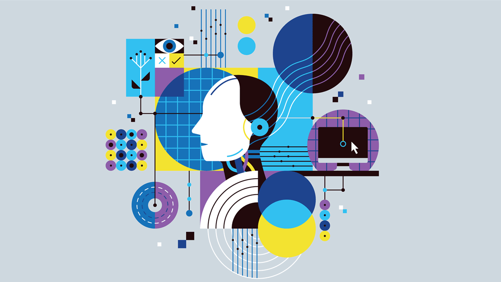

<!--StartFragment-->

Self-driving cars, metaverse, and cryptocurrency are things that appeared only recently. Today, we live in a rapidly changing society where tech companies intensely compete to lead the future. Although technological developments have brought positive outcomes such as economic growth and convenience in our lives, there are other important things to consider; these rapid changes should be examined in more detail. In particular, Artificial Intelligence (AI) has played a pivotal role in transforming our modern society.

Today, AI is used almost everywhere. There have been more than 370 investments by 700 venture capitalists on AI startups, accumulating to a total of $11.7 billion. Also, the number of research on AI has increased by 34.5% since 2019. AI has been developed to the point where it functions like a human brain when processing data; it has the ability to deal with extremely complex code or information. Furthermore, there have been significant advancements in the natural language processing (NLP) abilities, which enable the AI to understand all human languages and be truly conversational. Information retrieval, information extraction from non-standardized documents, speech to text, and opinion mining to read humans’ emotions are other functions that have substantially improved as well.

AI’s contribution to the biomedical industry is much appreciated. AI can be utilized to facilitate the process of discovering a new drug; it expediates the drug development process by testing numerous molecular structure designs of the candidates. In addition to the biomedical industry, AI can be used in almost all industries—education, fashion, and games to name a few—to accelerate the progress of each industry.

Despite the numerous benefits of AI innovation and technology, drawbacks and problems were also revealed. One of the big problems is that AI has been showing gender biased features. For instance, when translating “washing dishes” from Hungarian to English, the subject was translated as “she,” a woman. Since the majority of the people who are involved in AI development are white men (45% white, 3.2% Hispanic, 2.4% black according to the Artificial Intelligence Index Report 2021), Artificial Intelligence reflects human unconsciousness, producing a white male-centered perspective.

Another instance that raised big concerns about AI in Korea was the chatbot Lee Luda. Luda initially got compliments for communicating like a real person. However, as more users abused the chatbot, it started to make discriminatory remarks on disability, homosexuality, and social minorities. Although the developer Scatter Lab had censored certain words, the users still somehow made sexual conversations by using indirect expressions.

The Lee Luda incident shed light on an unresolved problem associated with AI. AI requires learning vast data, and this can cause privacy issues. For example, Luda was created by collecting 10 billion KakaoTalk conversations from the app users. People were not informed about this and did not know that their conversations would be used for an AI development. In fact, even their names appeared in some of Luda's responses. Like in Lee Luda’s case, AIs could exploit our personal information such as names, locations, preferences, medical records and more.

With rising concerns, the European Union recently announced that it will have a partial AI ban if AI systems are considered as “a clear threat to the safety, livelihoods and rights of people.” According to the EU, companies can be fined up to 6% of their revenues if they do not comply with the following regulations. Regulations include: ban on mass surveillance that track people indiscriminately, ban on social credit scores that can impact safety and privacy, bias prevention that track individual behaviors, and an advisory opinion to adopt judiciary decisions. Also, AI notifications must be sent to people when interacting with AI.

Although such implementations could slightly alleviate the current problems, they do not provide a definite solution to the AI debate. In order to make sure that the innovations and technologies contribute to the society’s development in a positive way, members of the society should work together. In the case of AI developers, they should be responsible when developing products and ensure that AI would not be misused. Therefore, they should consider all the possible risks beforehand and prevent any discrimination or hate that might arise. The government should also assist the developers to lead innovations in a proper and desirable way. To do so, the government will have to provide appropriate regulations, policies, and education. Lastly, we must not forget that us, the users, are also responsible for utilizing technology in a moral way. As AI has endless potential for development, the direction it heads to would be extremely important. We must work together so that these technologies and innovations bring us beneficial changes to our lives.

<!--EndFragment-->