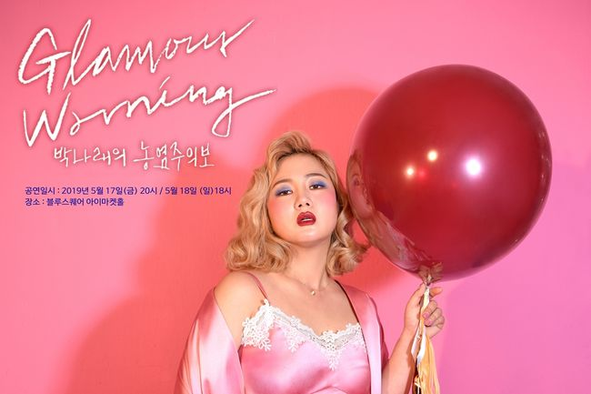

Since the comedy boom in the 1980s, stand-up comedy has evolved beyond an entertaining monologue into a valuable medium of cultural criticism and emotional catharsis. Due to its adoption of lighter language and humor, stand-up comedy allows its users to comment on politics, gossip, and current news in a tongue-in-cheek manner. As such, stand-up comedy has contributed significantly to cultural paradigm shifts by demolishing social taboos of language and venturing into risky territory without being overtly offensive. Recognizing the value of this, mainstream Western entertainment has used stand-up comedy for decades to neutralize relatively scathing, heavy criticisms in a jocular, blithe exterior.

However, up until recently, stand-up comedy has not achieved much success in South Korea, with the industry suffering from a dire lack of both quantity and quality. Due to social taboos and broadcasting regulations, no comedy programs in Korea dared to touch upon issues of politics, sex, or gender divide lest they offend viewers. The few comedians that did dare to try their hand at stand-up comedy received immense criticism for being politically insensitive and simply not entertaining enough (i.e. Byung Jae Yoo’s Black Comedy). As such, South Korean fans of stand-up comedy resorted to watching translated clips and Netflix specials of Western comedians such as Kevin Hart and Bill Burr instead, while the comment sections of these segments were dominated by laments of Korea’s traditionalist culture and wistful reflections on Western free speech.

A major shift in public perspective and interest occurred in October of 2019, with famed Korean comedian Na-rae Park debuting her first stand-up comedy special via Netflix, Park Na-rae: Glamour Warning. For an hour, Park jokes about her sex life and past relationships to an enthralled, at-times-abashed audience. Despite initial concerns of backlash and criticism, Park’s special was a smash hit. Given that no mainstream Korean comic had been able to pull off a stand-up comedy special with considerable success, this marked an unprecedented moment in entertainment history. According to culture analyst Dukhyun Jung, the success of Park’s comedy special was attributable to its appeal to a younger generation simultaneously exhausted with the conservative restraints of Korean broadcasting stations and exposed to more liberal content via Netflix and Youtube. Quite ironically, South Korea’s national public broadcaster KBS took note of this success and went on to sign Park as the host for their new comedy talk show, Stand-Up.

But whether the acclaim of Park’s performance is enough to spearhead the robust development of Korea’s stand-up comedy industry is still unclear. Many critics claim that only comedians with strong name value can host successful shows, as the Korean public is still unfamiliar with the concept of stand-up. This may help to explain why there have been only a handful of note-worthy attempts at stand-up since Park’s special. Even more concerningly so, the stand-up comedy industry of Korea is in the midst of two existential crises.

The first crisis lies in the development pattern of stand-up comedy in Korea. What is striking about most attempts at stand-up comedy since 2019 is that they are inseparable from the third-way feminist movement. For measure, the two most popular domestically-produced stand-up programs, Stand-Up Ground-Up Volume II and Stand-Up, both revolve around feminism. This is most likely because third-way feminists have realized that by utilizing stand-up comedy to publicly explore their sexuality and tackle gender issues, they could further their own agenda and purpose. Thus, most stand-up material in Korea does not focus on entertainment, but rather revolves around feminist activists discussing political issues such as LGBTQ rights and discrimination. What is potentially risky about this development is that stand-up comedy has become conflated with feminism and that the value of stand-up has become diluted as a mere medium. For stand-up comedy to truly thrive as a culturally valuable form of art, it is imperative that it detach itself from one specific social movement and instead explore the plethora of topics available.

Another existential crisis for the stand-up comedy industry lies in the global emergence of politically correct (PC) culture and cancel culture. As stand-up comedy is valued for pushing the line and being risky, it more often than not clashes with PC culture’s emphasis on sensitivity and awareness. Similarly, cancel culture now ensures that the utterance of one politically incorrect word could mean the demise of an entire career. Esteemed figures such as Chris Rock and Jerry Seinfeld have complained about such recent developments stifling the creativity of comedians and overall diminishing the value of stand-up. Others including Bill Hader and Craig Robinson, on the other hand, view PC culture and cancel culture as a positive change that “force\[s] comedians to talk about different things and broaden their horizons, but also force them to keep their edge in some kind of way.” Whatever the case may be, it is now evident that stand-up comedy has little choice but to mature in a direction that takes PC and cancel culture into consideration, lest it drive itself into irrelevance.