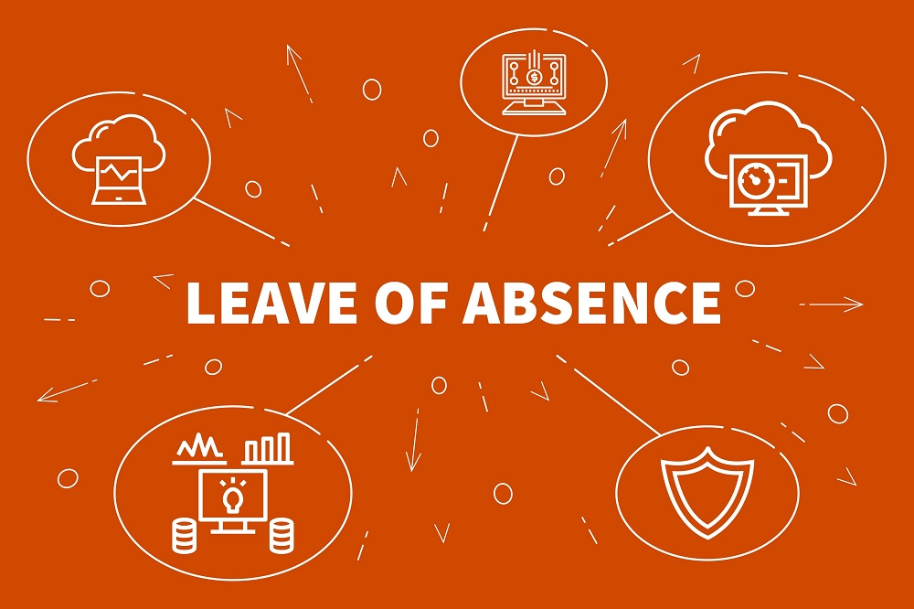

“Due to my country’s travel ban, I was stuck in Korea and also stuck in online classes,” says Nguyen Minh Phuong, a class of 18.5 UIC student majoring in Sustainable Development and Cooperation (SDC). As Yonsei University extended non face-to-face classes from the spring of 2020, Minh Phuong expects an indeterminate image of her future academic career.

During the time of uncertainty under Covid-19’s destructive influence, many Yonsei University students have made a tough decision: taking a leave of absence in the fall semester of 2020. While students normally take a leave to enjoy mental rest, pursue internships or complete the mandatory military service, in this difficult time, many withdrew one semester to protect themselves from the pandemic or to escape prolonged online classes.

“In my case, participating in online classes is a waste of time, effort, and budget. In the meantime, I also had some urgent family business. Therefore, no matter how difficult and complicated it was for me to take a leave and return to Vietnam amid Covid-19, I still had to do it,” says Minh Phuong. She also describes her inordinate amount of preparation prior to taking a leave of absence. “Before applying for a leave, I had to apply for the rescue flight first, which was an extremely competitive process. Only when I managed to book a flight did I apply for the leave. While I awaited the approaching flight date, I also applied for multiple internship opportunities in my home country to ensure that I would acquire beneficial working experience during the leave of absence.” Phuong believes that it would be much less troublesome to take a leave under normal circumstances but, overall, she manages to overcome the difficulties, learn invaluable lessons, and plan a productive leave of absence.

During the leave, Minh Phuong works as a project coordinator for Vietnam Green Generation Network, a non-governmental organization in Vietnam. Her responsibility — raising the youth’s awareness of environmental issues and sustainable development — varies from managing children’s education programs on climate changes to conducting research on Hanoi citizens’ behaviors and response regarding environmental aspects. During her internship, Minh Phuong has had the opportunity to apply her knowledge from UIC classes to real-life situation. “Recently, we have been researching on Hanoi citizens’ plastic waste littering and recycling behaviors. While conducting the study, I find the knowledge gained in Research Design and Quantitative Methods (RDQM) course extremely helpful to my current job, as I know which steps to take and which method to follow to analyze the data. It makes me feel happy since my study in college can finally contribute to the actual sustainable development planning of my hometown.” She proceeds by expressing her satisfaction with the leave of absence decision, claiming that she acquired an informative learning experience. “Though I will graduate one semester later than my friends, I continue to gain much practical knowledge that I would never have obtained if I solely attended long, theoretical SDC lectures, such as how I should run a real sustainable development project or how I can evaluate the project’s outcome. Also, in contrast to my uncertainty when I first declared as an SDC major, I now see a clear career pathway after graduation. It boosts my confidence with the major when I’m back at school.”

During a leave of absence, many students feel empty and unmotivated when they cannot fill their copious amount of free time with things to do. For Minh Phuong, she avoids this situation by working and doing exercises. “I spend four to five hours a day working in the organization. Working helps me feel that I’m creating an impact on social development, so that’s a strong motivation for me. Besides, when I have finished my job and feel bored, I will take a walk and breathe in some fresh air. Movements can truly spark energy and inspiration.”

Phuong plans to continue her study at UIC in the next semester. Yet, she believes the leave of absence in Fall 2020 is a sound decision for her circumstance. “This leave of absence is an opportunity to explore my possibilities and refresh my mind after the stressful 2020 Spring semester,” she says. “With some first-hand working experience during the leave of absence, I can come back to Yonsei next semester, willing to participate in more activities and internships in my interested field and be well-prepared for extra challenges.”\
Nguyen Minh Phuong’s story highlights the importance of new experience that a leave of absence can bring to one’s college life, especially when the college experience itself is undermined by Covid-19. With careful planning and a positive attitude, leave of absence will be a valuable chance for students to learn new insights and rejuvenate their minds, from which they will be more ready for upcoming challenges.