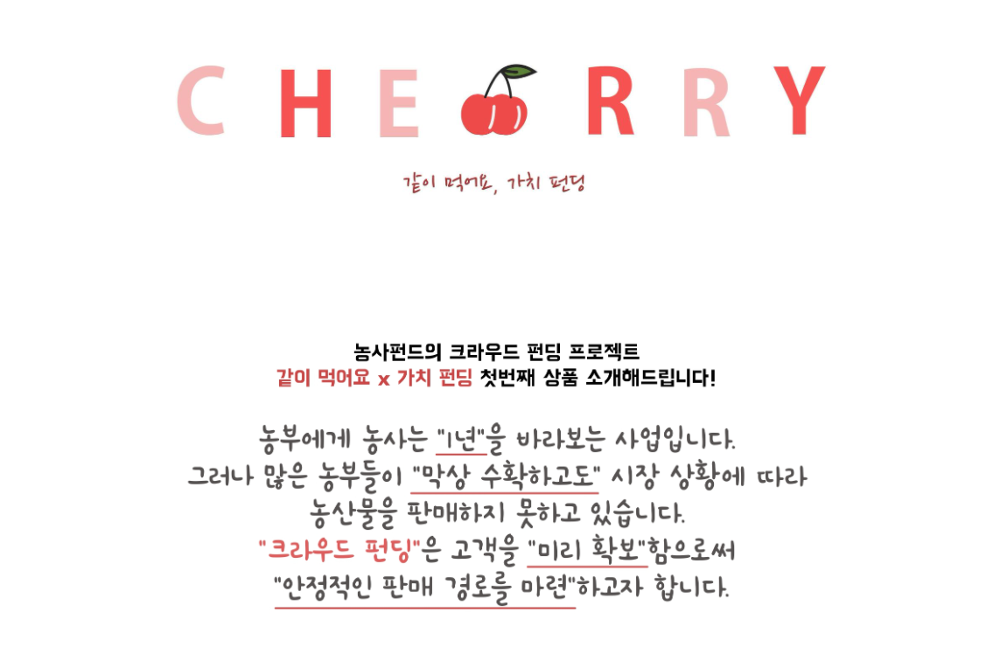

As the pandemic swept across the country this year, many industries have been facing a slump in market demand. The Korean agricultural industry has also taken a hit due to these economic hardships. The government’s guidelines to temporarily close schools have even discontinued farms’ opportunities for local school food procurement.

In order to help Korean farmers advertise their products to the public and offer viable market opportunities, Yoo Yeon Cha, a junior majoring in Political Science and International Relations at Underwood International College, has worked with a group of university students to organize a crowdfunding project for farms affected by the Coronavirus. 

This project began as a part of the Impact Basecamp sponsored by the J.P. Morgan Chase Foundation and organized by several universities, including the Yonsei University Institute for Higher Education Innovation. After months of training in problem-solving and data analysis skills from the Impact Basecamp program, Yoo Yeon began working with a startup known as Farming Fund. Farming Fund works in partnership with farmers to recruit sponsors by introducing the farmers’ agricultural products, price, value and harvesting plans on online platforms. The products sold are eco-friendly organic fruits that are harvested using low carbon agricultural technologies that produce a substantially lower amount of carbon dioxide emissions. Once they raise their funds, the farmers begin growing the products and reimburse the investment they received through high quality harvested products. The key factor that distinguishes this group from other agricultural marketing startups is their long term vision to help farmers connect and bond with their consumers.

Starting from February 2020, Yoo Yeon’s group began an in-depth analysis of marketing strategies for Farming Fund, such as re-setting the target market based on the company’s original consumer group and searching for farmers in Korea that best suit the company’s vision and mission.

The farm that the project group successfully collaborated with was a farm located in Chang Nyeong County that harvests sweet persimmons, red kiwi, Sato-Nishiki cherries and many more. After considering the harvesting period of different seasonal fruits and their popularity among family unit buyers with young children (the target consumer group), the group decided on Sato-Nishiki cherries as the agricultural product to be sold for their project.

There were great effort and precision involved in creating a marketing solution that not only garners the company’s visions to help farmers to form a lasting bond with their buyers, but also to achieve commercial success. After visits to the farm and communication with the farm owner about various advertising plans, including consumer events and newsletters about the farm, the project turned out to be a great success. According to the statistics provided by the group, the farm’s total sales of cherries were 2,881,000 won. The estimated amount of sales in 2020 without the help of the Farming Fund was 2,059,827 won, 38.5% lower than the sales from the previous year. However, the farm’s actual total revenue turned out to be 11,443,000 won, a 397% increase compared to 2019.

Farming Fund continues to collaborate with farms to produce high quality, organic, eco-friendly seasonal fruits. These products are grown with love and vision for solidity and bond between farmers and consumers.

As the global pandemic situation prolongs, COVID-19 has both consciously and unconsciously permeated various aspects of our lives, directing us to unexpected places and stages of life. The project introduced in this article has contributed to positive changes in the agricultural community and raised awareness for those in need of help. All of us are experiencing what feels like an insurmountable change in our lives, but it is vital to keep ourselves informed about the industries and individuals that have been affected during this difficult time and enduring an immense amount of pain.