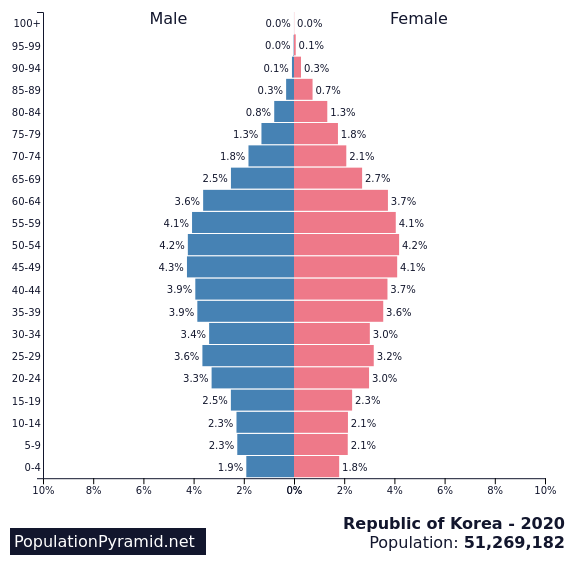

<!--StartFragment-->

“Record-low childbirths”, “demographic cliff”, “aged society”.

These must be familiar phrases to the average Korean person during the past several years. Indeed, they are not strangers to Korean society as of today, where we are seeing record-low birth rates every year – up to the point of becoming one of the countries with the lowest fertility rates in the world. Defined by the World Health Organization, the total fertility rate is a measurement of the average number of children born per woman per year in the age group of 15-49, the period in which a woman is able to bear a child. According to Statistics Korea, the total fertility rate of South Korea in 2020 was 0.84, which is a further decrease from 0.92 in 2019. Since 2015, fertility rates have been dropping at an alarming rate, recording the very first ‘less than one birth per woman’ in 2018, and is further declining. Among the 37 Organization of Economic Cooperation and Development (OECD) countries, South Korea has been the holder of the lowest birth rate for the past three consecutive years and is the only country with a birth rate under 1.00. No doubt, Korea shows a sharp contrast to other OECD countries, but exactly how big is this issue?

Figure 1 is the population pyramid of South <Figure 1>

Korea in 2020. As seen in the figure, the most obvious feature of constrictive population pyramids is that the percentage of adult and senile population outweigh the percentage of infant and juvenile population, making an inverted-pyramid shape, where the graph becomes narrower towards the bottom. As stated in the 2017 World Population Ageing United Nations report, it is true that countries with higher levels of development tend to have much lower birth rates than in developing countries. A majority of developed countries have low fertility rates, low mortality rates, and higher life expectancies, overall maintaining a steady state of population in all age groups. However, South Korea’s population pyramid is a highly constrictive one where the percentage of the elderly (65 and over) amounts to 15.7%, which makes Korea an ‘aged society’. It is predicted that by 2025, the elderly population would increase to over 20%, making Korea a ‘super-aged society’. In other words, economic growth would falter due to the decreased working-age population while welfare spent on the elderly would increase to burdening amounts for the younger generation.

But what was behind this drastic decline in Korea’s birth rates? There are multiple reasons that contributed to this phenomenon, such as concern over women’s career discontinuity, skyrocketing housing prices, difficulties in the job market, and so on. However, the cause seems to be something more fundamental: the heightened pursuit of an individual’s happiness over social expectations. If we were to describe Korea’s late Millennials and members of Generation Z in a single word, it would be ‘individuality’. More so than former generations, people nowadays value individual uniqueness, respect for one’s personal space, and individual benefit over social unity and integration. No longer are people tied to social standards of what is considered ‘right’, ‘proper’, or ‘expected’, but people prefer to define their own standards as to how they are to live their lives. Something that was considered the norm, such as marriages and childbirths, is now a choice that poses a question mark to one’s future. Women no longer feel the need to marry, bear a child and become a mother. Similarly, men do not have the duty to become the sole breadwinner of the family anymore. New family and lifestyle forms have emerged, such as the Dual Income No Children (DINK), where both partners work to receive an income and agree to have no children, thus having more to spend on themselves. As a result, marriage rates have been decreasing while the percentage of child-free married couples has been increasing.

Now what? Is there a solution to this conflict between individual pursuit of happiness and the possibility of a collapsing population? It is hard to say, since individualism and social egotism aren’t going anywhere; rather with increasing socioeconomic and gender conflicts and today along with the non-face-to-face culture that is settling in due to COVID-19, they are bound to be exacerbated, to say the least. Still, we may have hope of changing Korea’s population pyramid into not an expansionary one, but a stationary one, where even if birth rates are low, the overall population is maintained. The most obvious, but perhaps the only, solution would be for the government to provide clear benefits, both social and economic, for childcare. Initiated in 2018, Korea’s ‘Child Benefit’ policy provides social insurance funds of ₩10,0000 monthly per child under the age of seven. Aside from the fact that South Korea was one of the latest countries to introduce this system, Korea’s total family benefits classified by earning levels, age and number of children all fall behind on the charts compared to other OECD countries according to the 2018 data on family benefits. As an illustration, while France provides basic family benefits for children up to the age of 20, Korea’s childcare benefits cover only until preschool – a far cry from ‘practical’. Not only this, but new legislations or alterations in existing laws should be made to clear up gray areas regarding the extent of these social benefits, such as questions regarding the inclusion of full-time workers, fathers, and adoption in the ‘Parental Leave Subsidies’. Without some radical action on the part of the government, there might be no ‘happiness’ to expect in the future.

<!--EndFragment-->