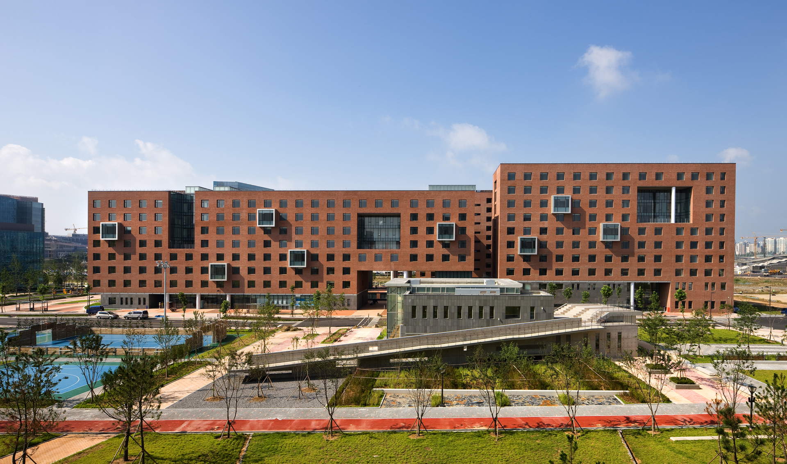

Since 2014, Yonsei University has made it a requirement for all freshmen to reside in the Songdo International Campus for two full semesters. The campus is located in Songdo, Incheon and consists of 21 newly built buildings. The Songdo International Campus is not just a place where freshmen complete their Residential College (RC) program requirements. It is also where students get the chance to mingle and grow a sense of community among themselves — a place where invaluable experiences offered by no other university are made.

With the outbreak of COVID-19, however, things have changed completely. To get a better glimpse of what students are missing out on due to the pandemic, I interviewed three Yonsei University students — each from the class of 2019, 2020, and 2021 — about their experiences on the Songdo campus.

**Jungyeon Choi** (International Studies, Class of 2019) belongs to the very last set of freshmen who were lucky enough to live Songdo campus life to its fullest. For her, spending her first year at Songdo was undoubtedly a priceless and unforgettable experience.

Recalling her memories of 2019, Jungyeon would run back and forth every day from Veritas Hall to Libertas Hall trying not to be late to her classes. After class, she would eat lunch at the Y-Plaza cafeteria, which had a decent variety of menus ranging from Western to Chinese. Whenever she had group projects, she would borrow seminar rooms in the dormitory or Underwood Memorial Library. The diverse RC programs also provided her with many opportunities to meet new people. As for her dorm room, she shared it with two students with whom she was able to form great friendships.

In her free time, she would hang out with friends at Campus Town or Triple Street, both of which were 20 minutes away on foot from campus. Another weekly routine was having late-night snacks delivered to campus, which she would share with classmates sitting on the famous chicken staircase. Clearly, Jungyeon made the most out of her life on Songdo campus.

Except for class hours, the campus would always be crowded with students forming a bright and cheerful atmosphere. At night, every pub nearby would be packed with students playing “alcohol games” all through the night.

“Staying up all night laughing, crying, and studying with friends — all of this was only possible because of my stay at Songdo campus,” she says.

**Hwajung Lee** (Culture Design Management, Class of 2020), on the other hand, has a completely different story to tell. Hwajung was all set and in high hopes of moving into the Songdo dormitory, only to find out that her class would, for the first time in Yonsei history, be excluded from the Songdo RC program as a result of the pandemic. Weeks, months, and a year passed as the pandemic got worse, and her classmates became known as “the cursed year students.” Frustrated, Hwajung searched for ways to enter the dormitory, and succeeded in doing so by becoming a Residential Assistant (RA) in her second year. This was the start of Hwajung’s life at Songdo.

Unfortunately, Hwajung’s campus life was very unlike those of the rest of her upperclassmen. The dormitory hosted only foreigners, RAs, and five other students. Due to social distancing measures, rooms for three were used by one, and all lectures were held online. Lecture buildings, dorms, and Triple Street became ghost towns with barely any students passing through. Strict regulations were placed on facility use: seminar rooms, community rooms, and dormitory cafeterias were shut down. If Hwajung wanted to meet new people, she had to actively search for opportunities by herself.

On the one hand, she is satisfied with the experiences she did go through at Songdo and the relationships she was able to make. But on the other hand, she is still upset about the foregone opportunities that upperclassmen had taken for granted.

Then what about the class of 2021? Were they lucky enough to get a place at Songdo campus? According to **Jiwon Lee** (Mechanical Engineering, Class of 2021), the answer is no. Just as it did to Hwajung Lee, COVID-19 took away from Jiwon the opportunities that he could only experience as a freshman. Jiwon was as eager as Hwajung to experience life at Songdo; accordingly, his story is based on a 4-week summer semester stay at Songdo campus.

As anticipated, Jiwon’s course was conducted online. Because academic facilities were off-limits, he would study in his dorm room or at nearby cafes. The lack of access to athletic and recreational facilities also forced him to leave campus often. There were barely any social programs, which students responded to by voluntarily creating Kakao chat rooms instead so that they could hang out, eat lunch, and play sports. On some nights, students would gather at the outdoor benches to drink and have fun. It was during these moments that Jiwon felt like he was finally living the life of a college student. Having overall enjoyed his stay, Jiwon plans to move in once again during the winter semester.

It is simultaneously a surprise and shame that life on Songdo campus could change so drastically over the course of just two years. While the only difference between Jungyeon, Hwajung, and Jiwon was the year they entered Yonsei, their experiences on campus are so different from one another as a result of one single event: COVID-19.