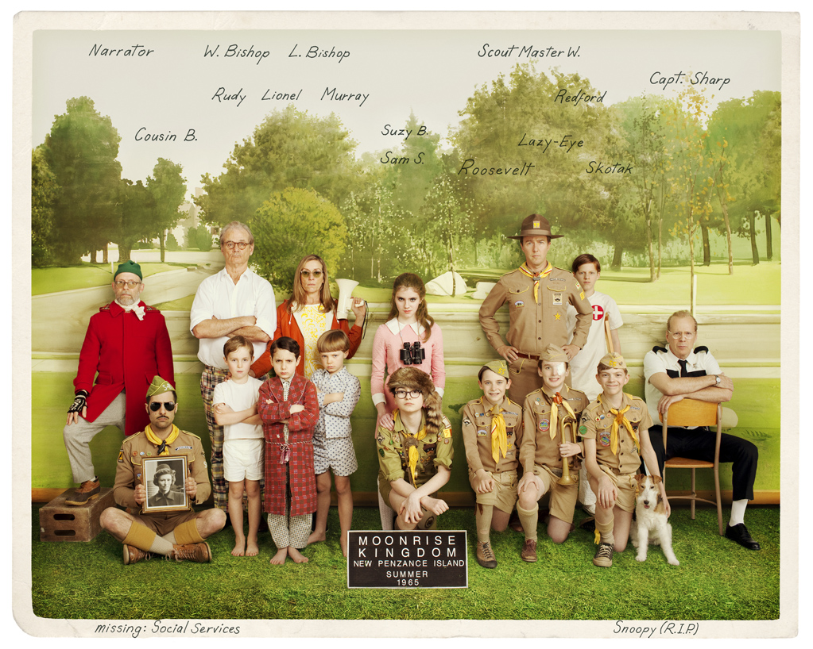

<!--StartFragment-->

Wes Anderson is famous for his idiosyncratic visual style with each shot densely crafted in symmetry and a distinctive color palette. His flair blooms in Moonrise Kingdom as well, a tale of two alienated twelve-year-old eloping to their haven. Due to its adventurous plot and Anderson’s directing philosophy, the movie emanates a storybook atmosphere with a flat, two-dimensional quality. It is surely a beautiful one, too, as Anderson maintains a warm color scheme that blends bright and dry pastel colors, mainly golden yellow, creamy beige, vermillion red, and brown. The color scheme has seeped into every last detail of the film from props, costumes, sets, and camera filters, establishing the balmy, dreamlike atmosphere of the film. As a result, there is a blend of nostalgia and melancholia thickly pervading each scene. When the pre-adolescent protagonists are on the screen, the childlike innocence evokes nostalgia; when the conflicted adults appear, there is a sense of melancholy, a longing for simpler times. This blurs the line between adults and children, playing with the concept of maturity. Adults can quickly return to childishness while children can display maturity beyond their years.

Set in such an ambiguous world, Moonrise Kingdom is a tale about two “emotionally disturbed” teens, Sam Sakusky and Suzay Bishop, eloping to their paradise in the deepest part of the island. The film traces how Suzy and Sam met each other and grew intimate by sharing their secrets. They eventually form and execute a plan to run away, raising tumult in the island. There is a personal layer to the conception of the story as Anderson explained in an interview: “I remember that when I was that age, that when I would read a book, the book would be my whole world…it is a romantic feeling at that age: you sort of lose touch with reality and it’s like entering into a fantasy right then, and I wanted to kind of do something that has related to that.” Consequently, the work feels like an invitation to his own fantasy land set in the New England coastal island of Penzance. The police office, the Bishops’ house, and the Khaki Scouts at Camp Ivanhoe give an impression of intricate dollhouses, all initially separate but eventually coming together. The audience is immersed in this enchanted miniature village of colors.

There are other personal influences besides the runaway plot. The music of Benjamin Britten, which constituted a great part of Anderson’s childhood, shapes the narrative and overall framework of the work. A flashback tells us that Sam first meets Suzy at a staging of “Noye’s Fludde”, an opera composed by Britten. In a press conference at Cannes, Anderson elaborated, “The play of ‘Noye’s Fludde’ that is performed in it—my older brother and I were actually in a production of that when I was ten or eleven, and that music is something I’ve always remembered…it is the color of the movie in a way.” Even the opera costumes in the film are inspired by Anderson’s childhood. The idea of a flood that will change the world, which is central in the story of Noah’s Ark, is present in the story as it reaches the climax. The scenery of everyone congregating in St. Jack’s church due to the storm is resonant of how the animals are assembled in an ark before the flood.

The movie’s opening is set to another work of Britten, “The Young Person’s Guide to the Orchestra”, playing from the record player. It sets out the framework of Moonrise Kingdom on the ideas of family and variation. This piece introduces the different “families” of instruments in the orchestra as a narrator explains each family as it makes its entrance. The work is a demonstration of how families of instruments in an orchestra work together to generate harmony. This reflects how members of a family play their parts to function. The instruments are also playing variations, which refer to different ways of playing the same tune. This connects to the theme of unity in diversity as there are all sorts of families around the world. While each of them has its own distinct dynamics, all the members cooperate to make the family work. All of these families are variations. However, some families fall apart: Sam gets abandoned by his foster family and an affair tears apart Suzy’s family. Such fall opens a space for new families to be formed as well. This returns to the theme of adventure in discovering something new; in this case, relationships.

Through new relationships, the protagonists construct their own world, establishing new individual identities through interaction. This is demonstrated in the montage of Sam and Suzy writing letters to each other, revealing fragments of their tough lives — Sam is isolated in his foster home and Suzy cannot adjust to her environment. Yet they find meaning through each other by sharing their secrets and exchanging their treasures. “On the Ground, Sleep Sound”, a choral interlude from Britten’s opera version of A Midsummer Night’s Dream, is played in the background. In the opera, the piece is a choral lullaby of the fairies to the four lovers who have fallen asleep in the enchanted wood. The reference serves as a parallel to Sam and Suzy’s own adventure as they escape from the adult world in search of a magical paradise, which is the moonrise kingdom. Moonrise here might refer to the word lunatic, whose origin comes from the root word, “luna”—meaning moon. The “moonrise kingdom” would be a kingdom of lunatics, a refuge for misfits to be together. It seems to be not a spatial but a spiritual concept, as even mile 3.25 Tidal Inlet of Old Chickchaw could be transformed into one.

<!--EndFragment-->