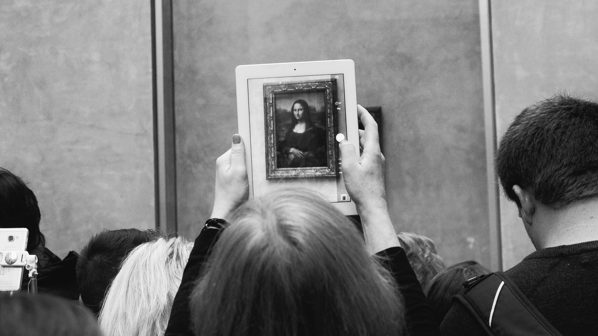

<!--StartFragment-->

A single JPEG collage of digital images sold at $69 million.

When Mike Winkelmann, known as Beeple, sold his “Everydays-The First 5000 Days” for $69 million, he was only in his fifth month knowing the “non-fungible token.” Hearing about this concept transformed his career: he earned the third-highest price for his artwork as a living artist. Then, what might be this “non-fungible token,” probably never heard or so poorly understood by people?

A non-fungible token, or NFT, is a unique digital asset traded online. It is unique in that it can be used to determine the authenticity and ownership of a particular asset. Although the asset might be copied and pasted, no one else can own the “original version” other than the person who bought the asset’s NFT, which is a code representing the asset. What is so interesting about NFT is that literally anything in a physical or digital form can be transformed into NFT, from music and drawings to a simple Tweet, like the $2.9 million Tweet of Jack Dorsey, “just setting up my twttr.” The technology for NFT appeared in the mid-2010s, when a site named CryptoKitties was established to allow people to buy and breed digital cats with cryptocurrency. Now, the NFT market is going beyond simple breeding of digital characters, with the art market getting extraordinary attention; as of March 2021, the market for NFT projects rose by 1785% in less than three months. This increasing diversity, attention, and rise of the NFT market is why NFT is worth knowing about.

Here are some basic facts about NFT before you start investing with hopes to become the next Winkelmann. Most NFTs are part of the Ethereum blockchain. The Ethereum blockchain is a digital ledger similar to bitcoin networks, but it includes NFT. NFT is different from bitcoins or ETH coins (cryptocurrency sold in this particular blockchain) as they are non exchangeable. As NFT indicates ownership of individual assets, “non-fungible” here means non exchangeable; that is, the token cannot be exchanged with another token as it has its own identity by its unique identification code and metadata. This distinguishes NFT from bitcoins, which are “fungible.” Furthermore, NFTs and the unique ownership they endow are quite secure as they are traceable through the blockchain network, which is resistant to external manipulation due to interlinked, private keys that alert peer networks when records are altered. This allows NFTs to be a competitive alternative to physical assets, which are vulnerable to external impacts such as theft. Think of NFT as unique customized clothes you put on your character for the Sims video game, each representing a distinct unchangeable identity of clothing and yet having the ability to be traded. Just like when you purchase an item for Sims, a buyer pays money in the form of cryptography from his digital wallet to the owner through an auction on digital platforms such as Nifty Gateway and OpenSea. When purchasing an NFT, the buyer gets the ownership record of the asset as well as access to the asset.

NFT is receiving lots of praise for its ability to assign “ownership” to digital goods and its contribution in moving the market for assets online. However, it is also receiving criticism for its complex terms of use and side effects. One notable ongoing controversy surrounding NFT is copyright. When NFTs are traded, like physical assets, the copyright of the asset belongs to the artist while the ownership belongs to the buyer of the NFT. NFT proponents argue that by ensuring sole ownership and copyright of digital assets, NFT positively impacts the digital art industry. Before, artists could not realize significant benefits in using online platforms for their artwork because the Internet makes art easily duplicable without offering any profit to artists. However, NFT ensures artists’ copyright, and furthermore makes artists gain appraisal for their work by selling their creative work and thus generating profit online as well. This creates incentives for artists to create more digital art. Yet, for critics, NFT has created a copyright dilemma by the subtle definitions of copyright and ownership in the online world. As mentioned before, the copyright of the asset in NFT form belongs to the artist while the ownership belongs to the buyer. However, the whole concept of copyright and ownership, especially copyright, is insignificant because the asset traded is in digital form. Since online assets like digital images are prone to easy redistribution, no matter how much NFT allows for sole ownership and copyright, the ideas of copyright and ownership themselves get blurred. The concept of copyright is further complicated by NFT being only a hash representation of assets instead of the asset itself. Thus, ensuring the copyright of the artist becomes very ambiguous, making existing copyright laws in the real world difficult to be applied.

At the start of April, the NFT market experienced a 70% drop after the crazy boom since January. The rather short boom of the NFT market, according to analysts, was just a temporary culmination of the prolonged pandemic and the distrust in the US dollar. Then, is NFT no longer worth investing in? Probably not. It is an undeniable fact that NFT has partially started the development of a digital market. Seeing that there are currently no better alternatives, NFT is still a meaningful investment, especially if you are an artist or investor looking for high profit. However, one should always keep in mind the functionality of NFT as they still carry downsides as an infant form of digital markets.

Sources:

<https://www.bbc.com/news/technology-56371912>

<https://ethereum.org/en/nft/>

<https://time.com/5947720/nft-art/>

<!--EndFragment-->