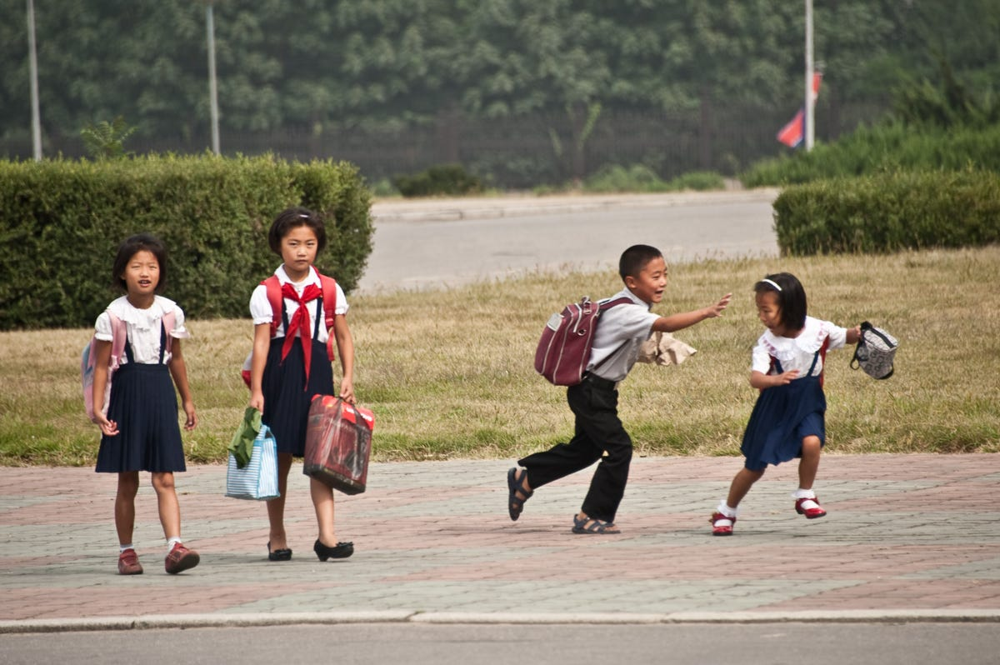

<!--StartFragment-->

We typically have a negative image of North Korea. What immediately comes to our minds are nuclear weapons, perfectly coordinated military parades, the dynastic Kim dictatorship, and the country’s dire human rights records. At the same time, we inevitably ask, ‘Why hasn’t there been a revolution to overthrow the government? Surely, that is what the people want.’ Yet more than 70 years have passed since the Korean division, and North Korea remains a resilient communist state. A standard explanation for the regime’s relative stability has been that North Korean residents are too fearful of repercussions or too brainwashed by the state to protest. However, the reality may be much more complex.

American anthropologist Clifford Geertz’s theory of the “theater state” offers an alternative approach to understanding North Korea. Geertz initially coined the term to describe Bali, where he believed symbols, myths, and rituals underpinned the sphere of politics, as opposed to the conventional ends of welfare provision and amassing military power \[1]. A similar analysis has been drawn on North Korea. The Kim family is well-known for their special interest in film production. For example, Kim Jong Il personally possessed a collection of 20,000 films, including all Academy Award winners, and kidnapped the South Korean film director Shin Sang Ok and his wife, to co-direct movies. Scholars like Heonik Kwon and Byung-ho Chung argue that, as a result, the leader aimed to run the state like a theater - on the basis of mass spectacles. The Arirang Mass Games, performed almost every year from 2002 to 2013, and recently resumed in 2018, epitomizes the regime’s foremost cultural production, as tens of thousands of citizens stage synchronized choreographies narrating the country’s socialist revolutionary history. This mass performance is geared towards glorifying the founding father Kim Il Sung as the hero who liberated Koreans from Japanese colonial oppression, albeit a distorted account of what actually happened. Simultaneously, the ritualization of the performance materializes the state’s ideology of collectivism. Whether willingly or unwillingly, the public practice of such cultural events enacts the state’s political agenda of fostering communist lifestyle, while reinforcing the expression of social harmony, and ultimately resilience.

However, implicit in the idea of theatrical performance is that a backstage culture must exist. As a closed-off state, North Korea remains a largely mysterious place in actuality. Our images of the country are confined to what the government chooses to present, namely, highly political pictures of unity like the mass games. In an interview with Professor John Delury, Chair of UIC’s International Studies program, he claims that “a mental image of normal people living normal lives” left a powerful impression after visiting North Korea four times. “Observing very simple interactions and activities like North Koreans walking around… in restaurants eating, or on a construction brigade in military uniform, but not doing military stuff,” allowed him to see an “apolitical or less political” aspect of North Korea, which rarely gets covered in our media. In one of his visits, he was brought to a soccer game, where he was surrounded by locals. It must have been a strange experience, as the very act of an American mingling with locals, betrayed the predominant anti-foreigners propaganda displayed in mainstream media. On another occasion, he found himself talking to a golf pro in his hotel, who gave him some golf tips. (He adds that he is not a good golfer!) So again, “it was just like talking to a normal person.”

Needless to say, having limited visits staying mostly in Pyongyang all four times, may have constrained the picture of the ordinary lives of citizens. Could the scenery of normal people living normal lives have also been a ‘performance’? In an interview with a North Korean defector (who escaped in 2014) from North Hamgyong province, she explains that compared to where she lived, a relatively rural area, “Pyongyang is a different world – there are metros, amusement parks, and museums, which you can’t find elsewhere.” When asked about whether North Koreans really believe in the greatness of their leader, she said that whereas her parents’ and grandparents’ generation seemed to think so, people her age – around their twenties – did not. Yes, North Koreans participated in rituals like ‘hosangbipan’ or self-criticism and peer-criticism sessions as decreed by the state, but the act was like a daily task, a part of a culture that did not necessarily follow genuine intentions. For instance, the interviewee mentioned that she would gather with her friends to discuss the content of peer criticism speeches directed at each other before actually presenting them in public to prevent misunderstandings of criticisms being genuine. When asked about whether she perceived a difference in her private and public life for political reasons, she responded that “in public events, people are obligated to sing songs that praise Kim Il Sung and Kim Jong Il, but the young generation normally listen to K-pop or Chinese songs in their daily lives.

We must avoid viewing North Korea through the narrow lens of politicized media coverage, whether from domestic or external sources. Behind the curtains of a theatrical performance, there are people with ordinary lives. Of course, this must not white-wash North Korea’s extensive human rights abuses or nuclear threats, which we commonly hear of. But contrary to mainstream narratives, we must recognize that there exists an apolitical side of the story. North Koreans participate in the regime’s symbolic and ritualistic practices of socialism as part of their public culture, not necessarily out of fear. Likewise, we cannot simply conclude everyone is brainwashed. Some people protest against the state-decreed rituals in their backstage culture - identifying ways to distinguish performance from reality among peers and exercising agency over their private lives when outside the earshot and view of authorities. Thus, by viewing North Korea as a “theater state,” we can capture a complex dynamic of the state’s power to materialize political agenda via mass cultural reproductions involving the local community, while concurrently allowing space for the local community to have agency over their alternative perspectives vis-à-vis the state.

Reference:

**\[1] Geertz, C. (1980). Negara: The theatre state in nineteenth century Bali. Princeton University Press: Princeton.**

(Image: Sam Gellman)

<!--EndFragment-->