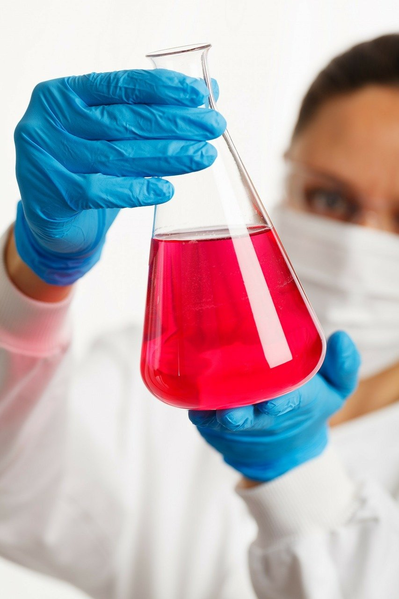

<!--StartFragment-->

Since the Spring 2020 semester, all classes, including practical laboratory classes, have been conducted online due to the COVID-19 pandemic. As such, science majors have had to adapt to obtaining scientific skills from “practical” experiments online. Understandably, students feel cheated out of a genuine learning experience and fear that a lack of hands-on experience will negatively affect their academic performance in the future. Moreover, online lab classes have been immensely challenging for all science majors due to a lack of readily available help, a lack of pertinent information needed to complete lab reports, and a general lack of tangible learning.

As soon as the full force of the pandemic hit South Korea, Yonsei University converted all of its classes online, including its lab courses. To the students’ dismay, the quality of the lab classes has not improved since last year. The basic format of the labs is as follows: online videos, an instruction manual, and a lab report. Students are to watch online videos where the professor performs a given experiment. The instruction manual appears as a PowerPoint Presentation, a few pages at the beginning of the lab report, or a separate document altogether. The structure of the lab report depends on the class and lab instructor. Often, the students merely need to answer the questions assigned by the professor, but in other cases, students have to write the entire report themselves based on the provided video explaining the experiment. Just as the structure of the online lab classes has not changed over the past three online semesters, the quality of the online teaching has not progressed either.

According to Dongha Choi, a 20.5 Life Science and Biotechnology major, he “feel\[s] as if the lab assignments are sometimes prepared incompletely.” He recounted an incident from last semester in one of his lab classes where the information provided in the pre-recorded videos did not correspond to that of the PowerPoint. Consequently, he struggled in answering the lab report questions since the given information was contradictory. He remarked that problems like these were common and continue to exist in the current semester as well.

Choi also believes that online labs do not provide students all the necessary information to complete the assignments satisfactorily. While being independent and proactive are quintessential qualities for college students, the answers to some of the questions are too advanced or specific to find online. Furthermore, although Choi believes that it is justifiable to adhere to non-face-to-face lab amidst the pandemic, he alleges that there remains a “general lack of learning.” The absence of a face-to-face environment allows science majors to evade the tedious process of collecting their own results. There is, however, an unmistakable difference in information retainment when it comes to doing the experiment firsthand and observing someone else do it. Choi “feel\[s] as if \[he] would have learned more if \[he] did the experiments with \[his] own hands.”

In response to the students’ reception of online labs, Yonsei’s President Seoung Hwan Suh recently announced plans to convert lab classes partially offline for the upcoming fall semester. According to the announcement, courses with less than 50 students at the Sinchon campus can meet face-to-face once a week as long as the lab rooms can accommodate up to 100 students. To be fair to students that cannot attend these face-to-face classes due to being overseas or not residing near campus, recordings of the lab experiments and alternative examination options will be available. However, lab classes will differ at the Songdo campus. At the International Campus, courses with a lab component will run as either blended or completely online, but Yonsei has yet to clarify how small the class needs to be to permit face-to-face labs.

For the past three semesters, science majors have been struggling to acquire the necessary skills for their future classes and careers. While some students are optimistic about returning to face-to-face classes soon, the reality depends on government regulations, which can change at any moment. And although Yonsei has stated that there will be blended lab classes next semester, this change is not guaranteed in any way as the COVID cases continue to rise.

<!--EndFragment-->