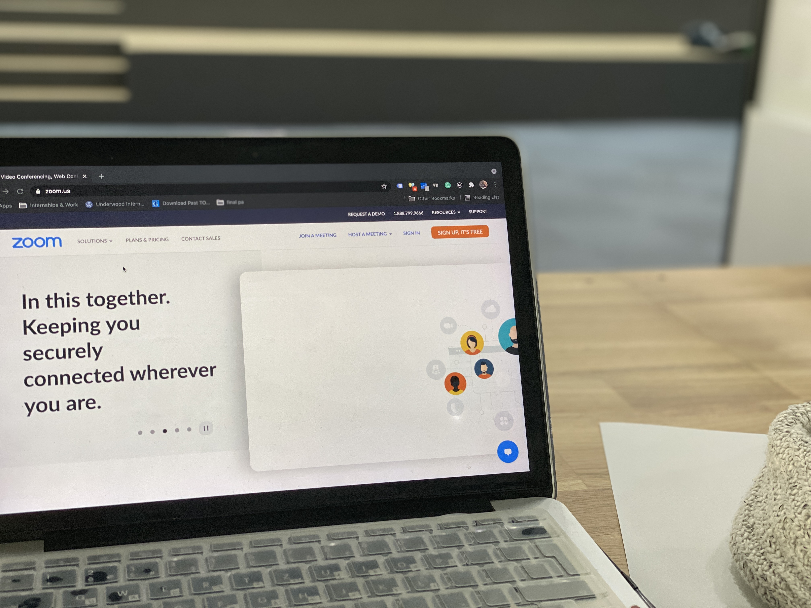

<!--StartFragment-->

For the many students worldwide, this month has marked over a year of COVID-19 and, with it,virtual classes. The number of institutions that have been forced to move to online settings is especially high in South Korea, where online learning has been strongly advised by the government since the beginning of the pandemic. While the third online semester at Underwood International College can almost feel like the new “normal” for some, the impact of such radical change in study settings is far from normal. Depression, anxiety, bipolar disorder are just a few examples of what many students had to battle with even before their lives turned upside down, and with the changes brought by the pandemic the impact on individuals mental and physical health is arguably even more severe.

Since the beginning of the COVID-19 pandemic, many countries have reported a soaring number of patients diagnosed with psychological diseases, especially major depressive disorders. Korea is no exception to this trend - the founder of the Seoul Central Mental Health Clinic Dr. Park Chanmin warned in his recent interview with the DW magazine that "since the start of the pandemic, people have become more and more worried about their jobs, they are seeing their incomes falling, and that is having an impact on their day-to-day lives." He also added that even though "social distancing in Korea is slightly different to other countries there is no doubt that it has led to higher levels of stress in people because the places they can go out and meet other people have been severely restricted." (1) As chronic stress has been often described as one of the major contributors to the onset of not only depression (2) its rapid increase is nothing to be overlooked.

Besides the changes brought to the society as a whole, for students who also have to keep up with rigorous studies glued to a screen for hours a day, the move online can truly become too. One US report from October 2020 stated that there is a positive correlation between student satisfaction with online learning and the prevalence of depression, anxiety, and stress. This paper also concluded that learning through online platforms has been related to the rise of depression and anxiety disorders among undergraduate university students. Several reasons were listed such as lack of sleep, greater time spent indoors, or less physical movement(3). One student from UIC expressed her sentiments by saying, “I felt unmotivated, with no drive and no energy and I honestly didn’t learn much.” An article from the director of the Hopkins All Children’s Hospital explained that college students, in particular, can be struggling to create an environment free of distractions and develop the necessary organizational skills needed to stay on top of their assignments, noting that these difficulties can greatly affect students’ mental health. Furthermore, as many students have to match class times set by schools in completely different time zones, their sleep schedule is even more in danger. (4)

UIC is no exception to this. Having the largest percentage of international students at Yonsei, a huge burden on the sleeping schedule is affecting many of our classmates. For example, one student said, “because I am in Europe, class time ranges from midnight to 10 a.m.. That has definitely been the most difficult: it’s like a very intense jet lag confusion and tiredness, and your mood is never the best.” Another student expressed her online learning issues “very confusing, tiring and does not help your class performance”. Since insufficient sleep can present one of the greatest risk factors for developing serious health issues - chronic sleep deprivation has been linked to for example increased risk of diabetes, obesity, heart attack, and stroke (5) - not just students’ mental health is compromised by the online semesters.

Students have always been a particularly vulnerable group to various mental health diseases even before the pandemic (7) and should hence receive adequate support primarily from their universities. Educational institutions should focus on making professional advisors and therapists more readily accessible and visible. . One UIC student expressedher wishes for “counseling to be readily advertised for students”. Yonsei used to offer special counseling sessions for international students available in different languages, but due to distance learning, those seemed to have been put on hold so the viability of foreign language support is uncertain.* “I have sought out support in the past and there was never an English-speaking psychologist available.” describes another student her past failed attempts when looking for help in Korea. It appears that there was a lack of adequate help for students struggling with mental health issues even prior to the COVID-19 pandemic, and looking at the negative impact of the virus, what will happen if the future remains online?

\* to contact Yonsei Counseling Center go to counsel.yonsei.ac.kr (website is in Korean)

(1) Ryall, Julian. “South Korea's soaring suicide, self-harm rates pinned on pandemic”. DW. https://p.dw.com/p/3iU6Z, 9/15/2020

(2) Carmine M. Pariante, Institute of Psychiatry, King's College, Neuro-endocrinology Briefings, "Depression, Stress and the Adrenal Axis."

The Dana Foundation, Washington, D.C

(3) Fawaz, M, Samaha, A. E‐learning: Depression, anxiety, and stress symptomatology among Lebanese university students during COVID‐19 quarantine. Nursing Forum. 2020; 1– 6. <https://doi.org/10.1111/nuf.12521>

(4) Balram, Amrita. “How online learning can affect student health”. The John Hopkins Newsletter. 4/2020. <https://www.jhunewsletter.com/article/2020/04/how-online-learning-can-affect-student-health>

(5) Institute of Medicine (US) Committee on Sleep Medicine and Research; Colten HR, Altevogt BM, editors. Sleep Disorders and Sleep Deprivation: An Unmet Public Health Problem. Washington (DC): National Academies Press (US); 2006. 3, Extent and Health Consequences of Chronic Sleep Loss and Sleep Disorders. Available from: <https://www.ncbi.nlm.nih.gov/books/NBK19961/>

(6) CDC. https://www.cdc.gov/coronavirus/2019-ncov/daily-life-coping/managing-stress-anxiety.html

<!--EndFragment-->