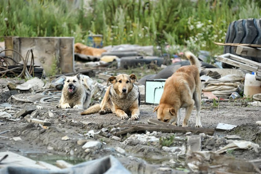

Pet ownership in South Korea has grown rapidly in the past decade. Today over 5 million households have at least one furry friend. Despite this, the number of stray pets also continues to increase at an alarming rate. Even the Yonsei campuses have become “home” to many homeless animals. The Korean Herald reported that in 2017 Koreans on average abandoned approximately 281 animals every single day! The total number of abandoned pets grew to over 100 000 that year. Due to the COVID-19 pandemic, which stoked fears that animals could be potential carriers, that number is likely to have risen. As a result, animal shelters that have been inundated with stray pets continue to put down hundreds of healthy animals every day. Why is this happening? Why are so many innocent souls, once lauded as “best friends” by their owners, being thrown away?

The primary reason is that it’s expensive to take care of a pet. When owners get their first friend, they are often unaware of the cost of attending to its various needs, such as, money spent on pet food and regular visits to the veterinary clinic. The latter, in particular, can be extremely expensive. According to the Korea Times, owners of regular healthy pets can expect to spend anywhere from 300,000 to 400 000 KRW just on annual health check ups alone. For pets with chronic or long-lasting diseases, the cost can exceed 1 million KRW per month. Moreover, because there are no extensive government regulations on veterinary fees and practices, many clinics overcharge the owner for treatments that might not even be necessary. Therefore, when people find themselves in a difficult situation financially, pets are often the first so-called “non-essential” things to go.

There are other reasons as well. A big problem is that many owners simply give up on pets when facing certain behavioral issues. Animals can exhibit behavior deemed undesirable by their owners. This is especially true for more energetic breeds that require special training. Inexperienced owners often just throw their companions out, instead of seeking professional help. In addition to this, owners sometimes abandon pets as a result of various lifestyle changes, such as while moving or during a breakup.

Many have called for stricter government supervision; the fine for pet abandonment has risen over the past few years and now can be up to 3 million won. However, because pet abandonment is not officially classified as a criminal offense, authorities are not allowed to fully investigate cases and offenders frequently escape prosecution. The government plans to implement stricter policies by 2024 to attenuate this problem. However, some of these policies have already become a target for criticism. For example, the proposed “pet tax”, which imposes taxes for pet ownership to increase funding for government run pet shelters, is likely to leave more animals without homes instead of preventing such tragedies. This is because it increases the cost of pet ownership which is one of the chief causes of pet abandonment in the first place. Moreover, many point out that it is unfair to tax owners because pet ownership does not provide any income. Other measures in the 2024 plan seem more promising. A broader definition of animal abuse, increasing the maximum sentence for the offense from 2 to 3 years, mandatory registration of pets, and special training for future pet owners are aspects of the policy that are expected to have salutary effects. Yet, the question still remains whether these measures can save even a few of the abandoned souls from a lonely future on the cold streets of South Korea.