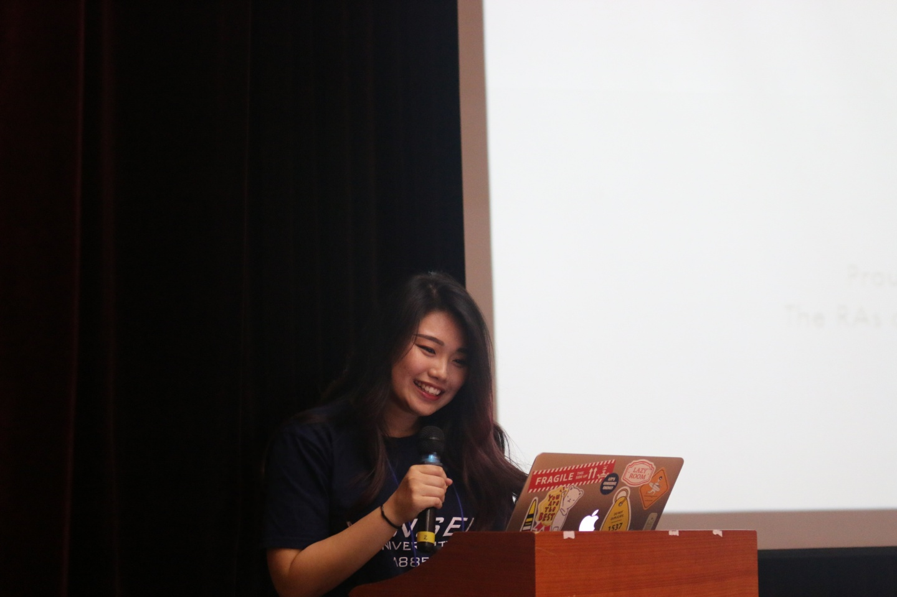

<!--StartFragment-->

What to do after graduation? This question undoubtedly concerns many students as they approach their final semesters at Underwood International College. Especially with the world rapidly changed due to the effects of the pandemic, there are many uncertainties as to how can students prepare for their life after graduation and how to make the most out of their college experience. A Summer 2021 graduate Dawoom Jung shares her senior dilemmas and highlights from her life inside and outside of UIC: what she enjoyed and what would she have done differently if she could go back in time and be a freshman once again.

1. **First, could you please briefly introduce yourself?**

My name is Dawoom Jung. I am Korean by birth, but I grew up in India my whole life. I came back to Korea and entered UIC in 2016. I am currently in my last semester, double majoring in UD International Studies and HASS Justice and Civil Leadership. Right now, I am also working as a Communications Officer at a non-profit Think Tank called The Asia-Pacific Leadership Network for Nuclear Non-Proliferation and Disarmament (APLN).

2. **What were some of the most memorable moments from your life as a UIC student?**

Those would be the times I spent with my friends, mostly in Songdo. I was able to feel right at home and thanks to the Residential College (RC) system, I didn't have much trouble making friends. Its really hard to feel homesick or lonely when you’re with your friends 24/7. Sadly, many freshmen are now missing out on the Songdo dorm life because of the pandemic. It really breaks my heart that a lot of them will never know the joy of ordering delivery and eating at the chicken stairs in Dorm 2.

3. **You also went on exchange, how did you enjoy it?**

I was lucky to get to experience a semester abroad in the US. Funny thing was that when selecting the schools, I didn’t know you had to list them in order of preference and I just added them in alphabetical order. Which is how I ended up going to American University in Washington D.C. and yet it ended up being one of the most memorable times I’ve had in my life. I met some of the most amazing people there and my time there helped me grow as a person. I’m now trying to apply to grad schools in D.C. because of it, and so I would say going on exchange is definitely worth it if you can apply.

4. **Since you mentioned applying to graduate school, what is it like preparing to leave UIC?**

For me, UIC is like a safe bubble. There are all these support systems - your friends, seniors, professors, etc. – that can help you. Everyone is very open and has a similar mindset – so it’s easy to collaborate with new people and have your own little network. You should make sure to take advantage of all of it while you can because once you leave, you’re on your own. That’s what scares me about leaving UIC but at the same time, I'm excited to venture out and try to find my place in the world out there. As of now, I plan to study International Policy and Practice with a specialization in nuclear issues in Asia for my masters. I will also keep working at my current job until I can go to graduate school next fall.

5. **What has been the most difficult when getting ready for graduation? Is there any support or help you wished to have at times?**

I’d say the most difficult aspect was completing the MR (= major required courses) of both my majors because one was a UD major and the other was HASS. I'm sure all the double major students would relate to how difficult it is to create an ideal timetable considering the requirements for both majors. I had to delay my graduation partly because of the lack of the particular MR courses offered in the given semester or their times clashing with each other. At one point I was emailing every UIC office and confirming with the academic advisor multiple times, which is probably the best way to make sure you can graduate on time and something all students have to pay very close attention to. It would be great if we had someone to help us check all the requirements before it is too late and also help us with graduate school applications. It can be very difficult trying to get all the info about different application processes and requirements. Something I'd advise other students is also to research whether the graduate schools require specific undergraduate courses, and make sure you have completed them.

6. **What classes or UIC programs would you recommend to other students?**

In my freshman year, I participated in the UIC Global Research Competition. I applied with my friends, again, without much thought, but the skills I picked up preparing for this are helping me even to this date. Our research focused on Korean-Filipino children, and we even got to study this issue in the Philippines in person. It was very challenging, and we were ready to give up many times but, in the end, we can proudly say that we completed a major project. We were very lucky to have supportive professors who were always willing to help us, something that I am grateful for even as I am currently writing my Senior Thesis. It can be difficult to find focus and get the work done, but I'd wholeheartedly recommend both opportunities. Being familiar with doing research and writing extended papers can be really helpful for your career and also great if you want to apply to graduate school.

7. **Could you also share a bit about what internships you have done and how you applied for them?**

After I came back from my exchange semester in the US, I had to decide whether to return to school for the fall semester, but since none of the MRs I needed were offered, I chose to instead take a leave of absence and look for an internship. I found a recruitment post for the American Chamber of Commerce in Korea on the Yonsei Career Website. Truthfully, I filled out my applications very last minute but I was lucky enough to get called in for an interview the next day and got accepted after receiving a call later that evening. The workplace was great, and my boss liked me so I took another semester off and stayed there for a total of 9 months. I had to quit eventually as I still had to finish school.

After that, I moved on to my current internship which I learned about through my friends at UIC who had already been interning there. They learned about it through Professor Bockett. When I asked, they happened to need a communications/PR intern, so I got the job right away. I was fortunate to find internships that required me to work in English but I know that it can be difficult to find ones where you don't have to be fluent in Korean and where there isn’t strict hierarchy. I wish we had more resources on not only internship listings but on getting used to the work environments and adjusting to the Korean workplace culture, which is something you have to be ready to do when you start doing internships. Also for me, being in college while interning at the same time has been very difficult so I would generally not recommend it. It was only possible since I did not have to take many credits during my last year and given that our classes are online.

8. **Lastly, if you could talk to your freshman self or other freshman students, what advice would you give her/them?**

I would say be thoughtful about where you invest your time and consider how the activities - electives, volunteering, clubs, etc. - would aid what you want for yourself in the future. Back then, I signed up for whatever that was offered without really thinking about who I wanted to become or what I wanted to do. I wish I had been more strategic about how I invested my time. Part-time jobs can be good for making extra cash, but I would’ve rather spent that time working on my GPA and on things that could’ve helped me in my future career. Also, stop sleeping in Western & Eastern Civilization. That grade can hunt you later. Don’t say I didn’t warn you haha.

<!--EndFragment-->