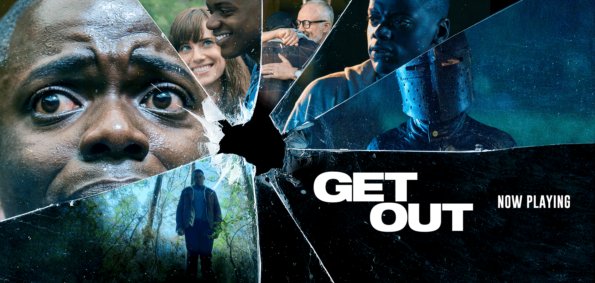

You have a voice, but you can’t speak. You have legs, but you can’t move. Someone else is in control of your body—your brain has been sub-planted by another. This makes a good movie scenario, but what if there are people who live like this right now? Jordan Peele’s Get Out (2017) presents the realities of racial discrimination today through a veil of thrilling horror—but it is a thin veil indeed.

As a social thriller, the film’s elements of horror enhance the film’s critique of modern racism. Chris Washington and Rose Armitage, a black man and his white girlfriend, visit Rose’s parents’ house over the weekend. What Chris doesn’t know is that the Armitages run the Coagula Project, a medical procedure in which they transplant white people’s brains into black people’s bodies. Rose is their hunter, and he is the deer whose skin they are after. The hunter-and-hunted relationship between the white and black characters exaggerates the subtle social hierarchy between races, effectively putting the viewers in the shoes of both the fictional and true social minorities.

The Coagula Project, which combines the “superior bodies” of black people and the “superior minds” of white people, believes in desirable qualities specific to each race. This belief is based on positive stereotyping, which attributes positive traits to certain communities merely because of their race, gender, or other characteristics. Chris is continuously objectified as a certain “species” rather than an individual, subject to supposedly genial comments such as “black is in fashion” or “with your frame and genetic makeup…you could be a fucking beast.” In a sense, Chris’s complexity as an individual is replaced with a generalized idea of “blackness.” In the end, the Project’s admiration of the black only goes skin-deep, reflecting our own stereotyping of ethnic minorities based on superficial understandings of their culture.

After the brain transplant, the host’s minds are banned into “the Sunken Place,” forced to become a spectator of their own lives. This loss of self-expression parallels the lack of advocacy for black people in the media today. Media representation of black people is scarce, and what little representation they have is often misleading, filtered by white executives. Like most minority communities, black citizens lack the socioeconomic leverage to counter such portrayals through the mass media.

Despite the atrocity committed against the black community, the police remain a hostile figure for Chris throughout the film, who readily complies with discriminatory demands by the police out of fear for his own safety. For example, Chris willingly shows a cop his driver’s license after a roadkill incident, even after it was made clear that Rose had been driving the car. Chris’s knowledge of his own disadvantage is made even more blatant by the end of the film when he manages to break out of the Armitages’ house. As Chris starts choking Rose, a slow triumphant smile twists her mouth, reminding him of how the world works; if he kills a white woman, he is definitely not getting a fair trial. This is why, despite being the victim, Chris automatically raises his hands up in the air when a police car arrives on scene. The wary, resigned look on his face at the sound of sirens is not at all what you might expect from a person about to be saved. It is only when Chris realizes it’s his NSA friend, Rod, that he knows he is finally safe.

Rod warned Chris never to “go to a white chick’s parents’ house” from the beginning, and even Chris had told Rose, he “\[didn’t] want to get chased off the lawn with a shotgun.”

Are they exaggerating?

Not as much as you would want them to.

George Floyd, killed by asphyxiation from a knee to the back of his neck; Jacob Blake, shot seven times in the back and currently paralyzed from the waist down; Breonna Taylor, shot eight times while sleeping at home with her boyfriend; unarmed black men and women who were killed by white police officers in 2020. According to Mapping Police Violence org., black people in the U.S. are three times more likely to be killed by cops than white people, despite being 1.3 times less likely to be armed. The Black Lives Matter (BLM) movement has surged into global visibility only this year, but the organization has existed since 2013, and illegal violence against black people has been an ongoing issue since the Civil Rights Act of 1964.

Although Get Out was released three years ago, it is now more relevant than ever. However, it is not a prophetic film foreboding the racial issues of 2020. Black discrimination was just as bad then as it is now. It is merely that the audience has caught up three years too late. But then again, the same may be said for many other social commentary films made in the past; there was Moonlight in 2016 and Us in 2019, another social thriller by Jordan Peele. Each had spoken of racism in its own times, and yet little has been moved to change by their cultural efforts to give voice to minorities.

We often describe Justice as a figure holding a sword and a scale with a blindfold over its eyes. But its blindfold seems to be void, its scale dipped and its sword slow to cut when it comes to racism.