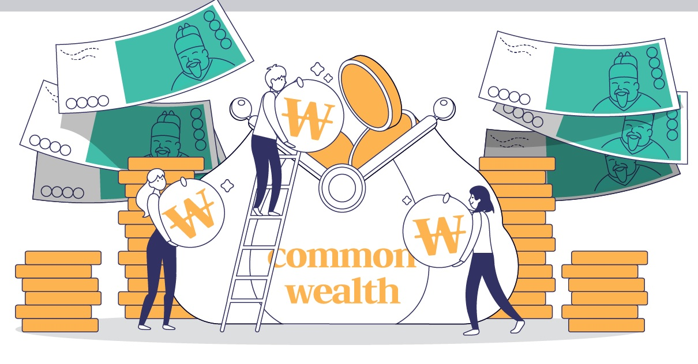

<!--StartFragment-->

COVID-19 will be leaving a significant mark in Korean economic history. South Korea tried to create policies that would reduce negative economic effects of COVID-19, specifically the issue of decreased spending that leads to less economic transactions, and hence a recession. In 2020, the South Korean government implemented the “emergency disaster relief funds,” a series of policies aimed at mitigating the imminent recession. The first emergency disaster relief fund was temporarily successful at increasing the population’s consumption of goods and services such as eating out more often or spending more money on leisure-based activities. The policy started distributing based on equality to all citizens, but then changed to be based on equity in an effort to aid self-employed businesses that were seen in greater need of support in the pandemic as there were still significantly less customers even with the implemented policy. Although the emergency disaster relief funds were a good effort to help those in need, it had problems such as having speculation of having little effect on the economy, populism, and ambiguous standards.

The first emergency disaster relief fund aimed for equality by giving 100,000 won to all citizens to increase their spending. The population’s consumption did increase by 4.6% in June 2020 compared to May 2020. However, in the long-run, the policy did not benefit the economy. Once the citizens spent their 100,000 won, their spending would once again decrease. Overall, consumption rose about 0.16 percent due to the relief fund, which, comparatively, required a 14 trillion won budget. To put it into perspective, one wave of relief funds required nearly 20% of the 79 trillion won administration yearly budget. Considering the fund’s effect only lasted about a month, it did not seem to be a huge help considering its significant amount of 20% percent. These lackluster results showed the government’s policy was clearly not working.

Another point that was brought up while enforcing the fund was the debate about populism. While the fund was in discussion, the opposition party members claimed that giving 100,000 won to all citizens was a means to appeal to the public for upcoming elections. This is where claims that the government should rather be spending its funds on those who have been hit harder compared to others due to the pandemic rather pandering to the general public partaking in the election process.

The government then decided to change their policy by making it equity-based and targeting self-employed businesses—the difference between equity and equality is that equity aims to aid those in need while equality aids all equally. Private businesses faced a harsh economic downturn since the pandemic caused a drop in face-to-face interactions, social restrictions, and encouraged less public activity. Although it started from a good cause, the standards for the fund were unclear. An example was not properly considering lost revenue during the pandemic. One of the requirements was to have earned less than 400 million won during 2019. However, since the pandemic started during 2020, it did not seem reasonable to consider the revenue earned beforehand. Another controversial point was that bars and clubs were also subject to be supported although many cases spread from these places due to poor COVID coping measures. Because of such reasons, there have been criticisms that the standards were not suitable for the businesses that need help.

Despite the efforts, the disaster relief funds faced problems whether they were based on equality or equity. The equality-based relief fund was questioned for its fundamental effect and possible populism. When changed to help self-employed businesses, it was criticized for its arguable standards. Something had to be done to relieve the impact, but the relief funds needed a 45 trillion won budget. There was not much the country could have done to minimize economic impacts on a short notice. As the pandemic continues and the government is planning another relief policy, it should also try to support those other than just self-employed businesses and have requirements to select adequate recipients.

<!--EndFragment-->