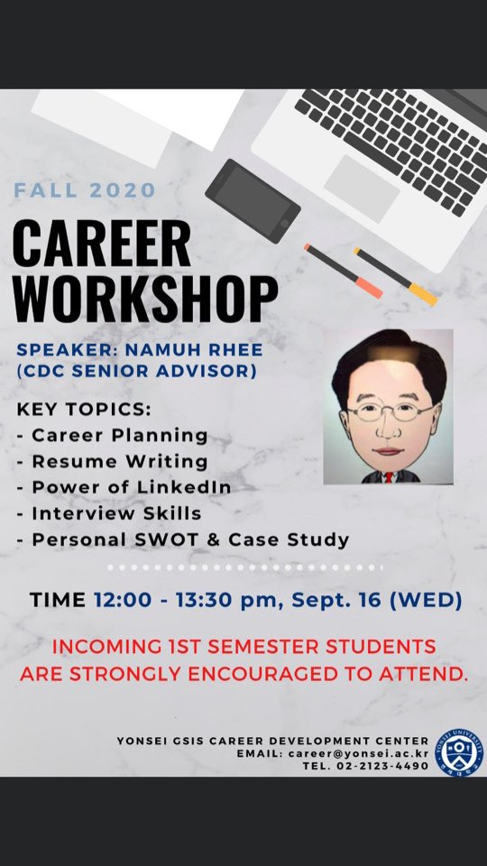

The Career Workshop hosted by Professor Namuh Rhee in cooperation with the Yonsei Graduate School of International Studies (GSIS) was held online through Zoom on the 16th of September. The cornerstone of the lecture was professor Rhee’s extensive and impressive resume that includes 30 years of banking experience in Hong Kong, Singapore, and South Korea; being a top-ranked Korean strategist; and a managing director with the Bank of America Merill Lynch, Nomura, and Samsung Securities. The professor’s accolades and passion towards the presentation made for an informative session regarding the steps a university student should take in order to optimize their journey to their dream career. In just two hours, the Career Workshop provided insight into four different categories: career planning, resume writing and Linkedin, interview preparation, and personal strengths-weaknesses-opportunities-threats (SWOT) analysis.

From the career planning segment, I learned about just how big the world is. One of the biggest lessons was about the outsider problem and the value of networking. The outsider problem refers to how many people gain advantages by being close or networking with others, while those who do not have such connections are left as outsiders. As simple as it may sound, the solution to the outsider problem lies in networking. Networking essentially means that you can gain huge advantages by keeping in touch with many people who, at some point, may help you get a job opportunity. Another noteworthy lesson was concerning the industries you choose to apply to and how researching can be an invaluable tool to get through selective job interviews. After that, the workshop went into how to write an effective resume. The workshop offered the most rudimentary advice, such as having a 1-page resume and making sure your resume is spotless, all the way to advanced tips, such as having education as your first category, having multiple resumes to target different job markets, and more. The final takeaway was in regards to the platform LinkedIn, which is the bread and butter of finding career prospects and getting the ultimate upper hand in the job market.

Next, the workshop delved into how to prepare for an interview. There was advice about how to be a more impressive interview candidate and even many example interview questions. My most valuable lesson was the point that the interview is two-sided, where the interviewee can also be the interviewer and still showcase his or her own expertise by asking memorable questions. Finally, professor Rhee introduced the SWOT analysis method of analyzing one’s strengths, weaknesses, opportunities, and threats. The point of the analysis is to be honest with oneself and to see what the next steps should be in order to create the most appealing resume and set of skills for companies to want to hire you!

On a personal note, professor Rhee is very outgoing and always willing to help students who require career advice. Professor Rhee is highly driven and encourages students to do their absolute best throughout their studies to ensure that they have the best future they can secure themselves. Although much of the workshop may seem intuitive, some tips are invaluable and create a holistic picture of what the job market is like in reality. I learned that our time is precious and effectively allocating it is necessary in order to get the job that we want. If you are interested in career development as a university student-and especially as a student starting their first semester either in GSIS or even as a bachelor-then, this workshop is for you.