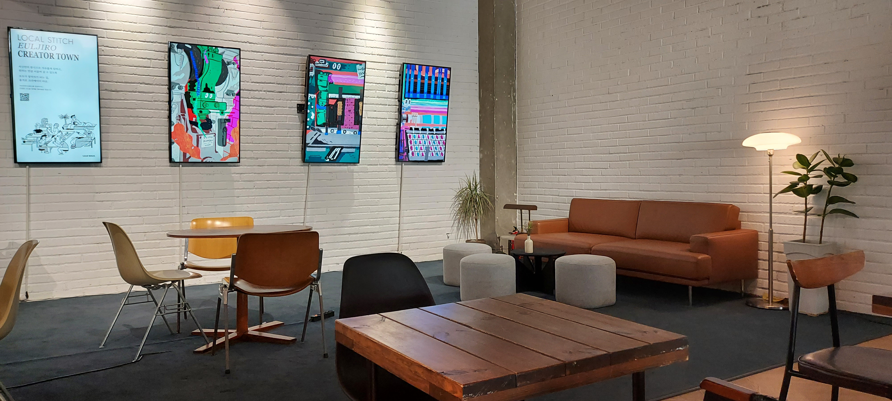

Location: Cafe Yoho is situated at an intersection, twelve minutes by foot from Hongdae Station, one stop away from Sinchon Station. The cafe has three stories, with the second floor being their brunch cafe, and the third floor, a gallery. The first floor is the main cafe area, where you can find all sorts of seating and outlets for visitors to plug in and work the day away. 

**Good:**

* The cafe has a modern industrial design, with the high ceiling being left open to expose the pipes which have all been painted or coated in black. Statement pieces contrast the industrial design, with bright colors and various lamp structures on both the ceiling and the ground.
* The cafe is also a bakery, and their baked pieces are on display as you walk into the store.
* There are plenty of seats to choose from, whether you would like to sit perched up on a stool, at a table for two (round or square), or at the long workspace bench in the middle of the room - complete with two to three electrical outlets so your laptop doesn’t die on you as you work.
* Lots of students, artists and freelancers come in to work for hours at a time, making the environment more suitable for long study sessions.

**Meh:**

* The music at the cafe is slightly loud and may not suit your taste, so make sure to bring some earphones.
* It is a somewhat silent workspace during the day, so if you want to come here for group work or to hangout with friends, make sure to come closer to the evening.
* There is a limited amount of electrical outlets depending on where you are seated.