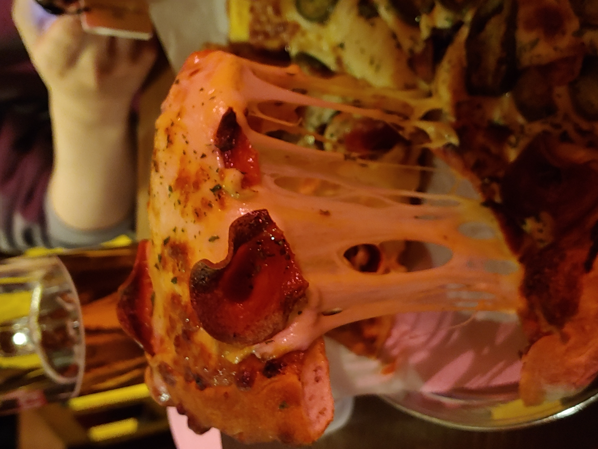

Location: Down the second alley to your right, across the street in front of the Yonsei University Sinchon campus main entrance. Right side of the road.

**Good:**

* Honestly, the cheese is amazing. The pizza is always served right out of the oven, piping hot. Here, you’ll never come across a pizza that is dry, lukewarm, and doesn’t give you the ‘cheese stretch.’
* 1987 Pizza gives you the perfect ambience of a casual pub - from the elaborate interior design, the music playing in the background, to the projector screen in the corner playing retro ‘90s videos.
* The menus are simple yet tasty and fulfilling. The pizzas are relatively cheap as well – 15,000 won at most, even with the half & half pizzas. Also, the draft beer goes great with the pizzas, so if you’re up for some ‘pi-maek’(피맥), this is the place!

**Meh:**

* If you’re not a fan of restaurants on the basement floor, this would be a meh, though the air circulation inside the restaurant itself must have been okay since it didn’t feel stuffy at all.
* The tables are situated a little too close to each other, but thanks to the boards between the tables (due to Covid-19), it’s less awkward when the seat next to yours is occupied.