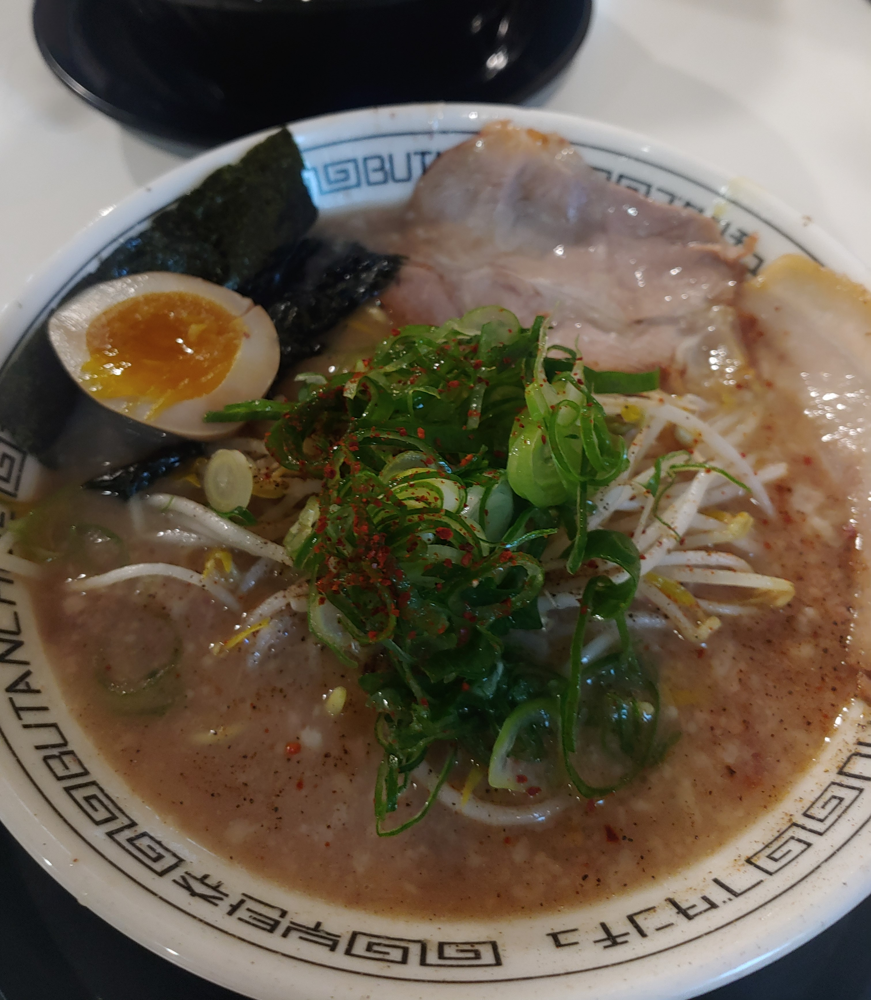

<!--StartFragment-->

Location: A four-minute walk from Shinchon Station: two blocks in from the main street and across from that little park behind Hyundai Department Store.

Good:

* It’s practically a ramen buffet – you can choose from four types of ramen (broth), three types of noodles, and a variety of toppings. There’s also a little explanation under each type of ramen so it’s helpful if you’re new to Japanese ramen.
* One bowl is quite filling for the average person and it’s only 7,900 won! Plus, you can order both extra noodles and a bowl of rice for free, so no pressure. Also, free wi-fi.
* The ramen itself is reminiscent of that bowl of ramen you tried in Japan. It’s delicious. The broth is thick and savory, the boiled egg is just right, and they give you two large pieces of char siu.

Meh:

* It could feel a little greasy by the time you finish your bowl, but well it’s Japanese ramen.
* You could get unlucky during lunch/dinner hours and might have to wait in line. It was packed the last time I went, which was at about 5 pm, and I still had to write my name on the waiting list.

<!--EndFragment-->