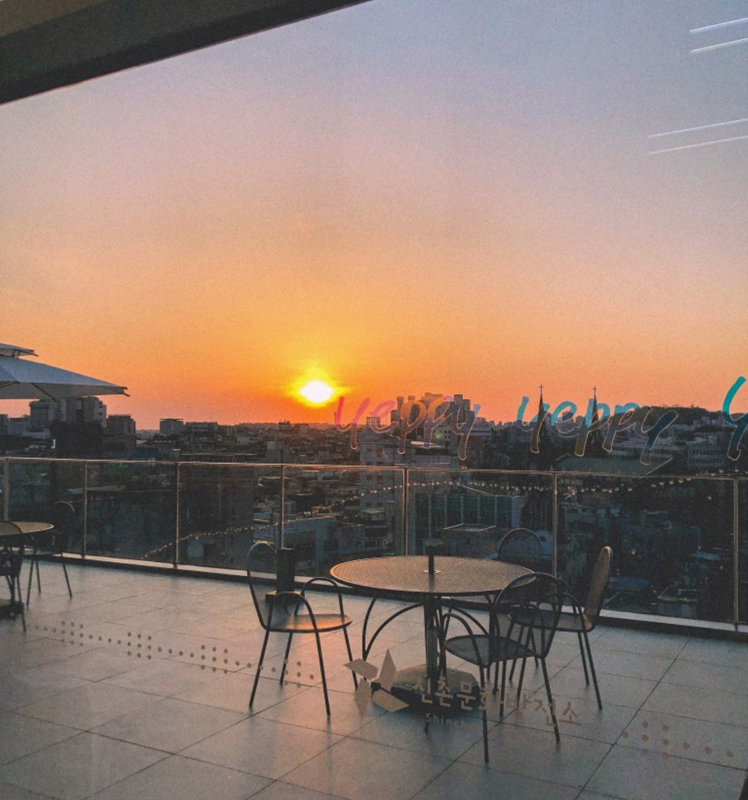

<!--StartFragment-->

Location: Café Baram is a five-minute walk from Sinchon Station Exit 1 but might be a bit difficult to locate on your first visit. Yet, actually all you have to do is take the elevator or go up the stairs from one alley. Find the Sinchon-dong Community Service Center first, and right behind it, you’ll see it – on the third floor of the Sinchon Arts Space (SCAS)!

**Good:**

* If you enjoy spots with great views, this is the place for you! There is a rooftop terrace on the fourth floor; the afternoon sunset is especially beautiful. It shows both all of Sinchon and breathtaking mountain scenery as the café is located at the bottom of Baramsan, also known as ‘the Windy Mountain’.
* The place has great service for students like us! You can get a student discount of 500 won and free snacks just for ordering a drink. Plus, everything on the menu is very affordable – the price for iced americano is only 2500 won with the student discount, smoothies only around 4000 won. The café is especially known for its handmade scones!
* The place first opened in 2018 but is not that well-known until now, meaning it will probably continue being a ‘secret hideout’ for those who prefer quiet, spacious places to popular, crowded places. So, I recommend it as a great place to study or organize regular group meetings.
* You can enjoy today’s hottest books and magazines of various genres! The quiet atmosphere and comfortable seats make it even better to concentrate.

**Meh:**

* The non-coffee beverages like the smoothies, tea, and bottle drinks are generally better than the coffee menus. So, if you’re a huge coffee lover, you might find other places more appealing.
* The café is located on the hillside rather than near Sinchon’s main streets, so the way up might be harder than you think. (I personally think the view of the café will make up for all the effort though!)
* The windows are all very wide. So, if you tend to focus better in ‘closed’ atmospheres, you might find yourself being more productive in study cafes with the sole purpose of studying.

<!--EndFragment-->