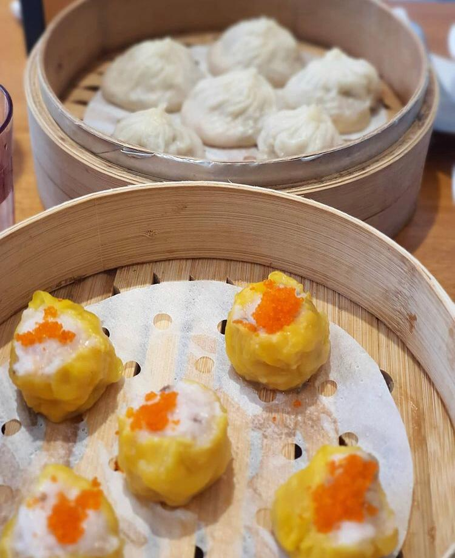

<!--StartFragment-->

Location: Approximately 10-15 minutes away from the front gates of Yonsei University, Sinchon campus. (Address: 1층 Cheonghwawon, Sinchon-ro, Changcheon-dong, Seodaemun-gu, Seoul)

Good:

* They serve a large variant of Chinese food. Their plating is especially neat, which makes the food look more appealing.
* Their servers are welcoming and there isn’t usually a long delay between ordering time and serving time.
* The prices are pretty affordable for college students. The price for their dishes range from 6,000-22,000.

Meh:

* The menu has pictures of each dish, but no English transcriptions or romanized text so foreigners who aren’t fluent in Korean might find it difficult to order.
* The restaurant fills up quickly, especially during regular mealtimes. I recommend coming earlier.

Image credits go to instagram.com/ohayo1024

<!--EndFragment-->