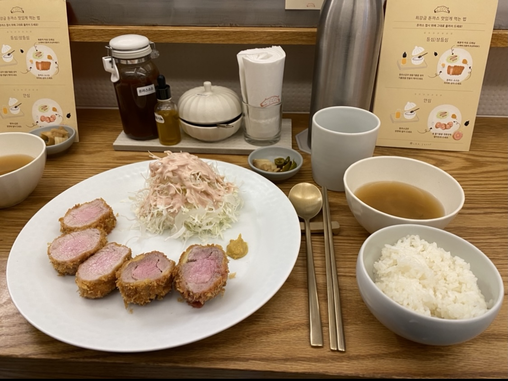

<!--StartFragment-->

Location: Near Hapjeong station, which is two subway stations away from Sinchon. It is a 5 minute walk from exit 8 of Hapjeong station. The restaurant specializes in tonkatsu and only has three menus; sirloin cutlet, tenderloin cutlet, and premium sirloin cutlet.

**Good**

* Fresh and high-quality ingredients: All main menus are made with black pork meat from Jiri Mountain, and the ingredients for the side dishes are sourced from Jiri Mountain as well. Using high quality ingredients, the meat is juicy and thick, and the homemade side dishes and desserts are fresh and delicious.

* Kind service: The restaraunt provides a short manual explaining the best sauce combinations according to the menu for all customers. The restaurant staff are also very kind and are quick to answer any questions customers have.

**Meh**

* Waiting time: Because of its popularity, the restaurant always has a long line. Even if you go on the weekdays, you will still have to wait at least 20-30 minutes.

* Small size of restaurant: There are not many seats so the restaurant gets packed easily.

<!--EndFragment-->