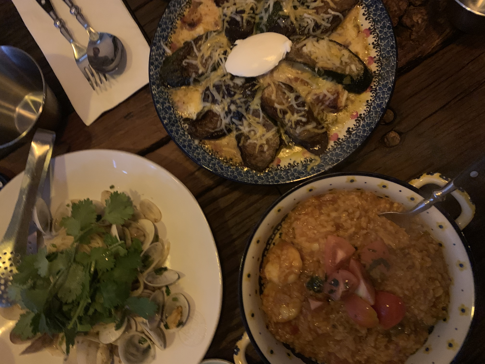

<!--StartFragment-->

Cilantro Kitchen Songdo

Location: Located across the street from Songdo Central Park. Takes around 10 minutes by car, 30 minutes by bus from Yonsei University International campus(194, Central-ro the sharp centralpark2, 128 A dong).

Good:

* Personally think that it is the best restaurant in Songdo. All the menus are delicious, but I especially recommend “Louisiana Jambalaya” and “Ratatouille Lasagna” which use fresh ingredients and taste absolutely amazing.
* It has an “open kitchen” where all of the cooking process can be seen. This transparency ensures cleanliness and the hygiene of the restaurant.
* Servers are friendly and they always kindly explain how to best enjoy the dish.

Meh:

* It is a small space, so it can be crowded sometimes. Also, I recommend making a reservation before going there, especially if you are planning to have dinner.
* Some dishes can be quite pricey. Most of them are around 15,000-20,000 won each.
* It is located a bit far away from the campus, so I suggest going there when you are visiting Songdo Central Park.

<!--EndFragment-->