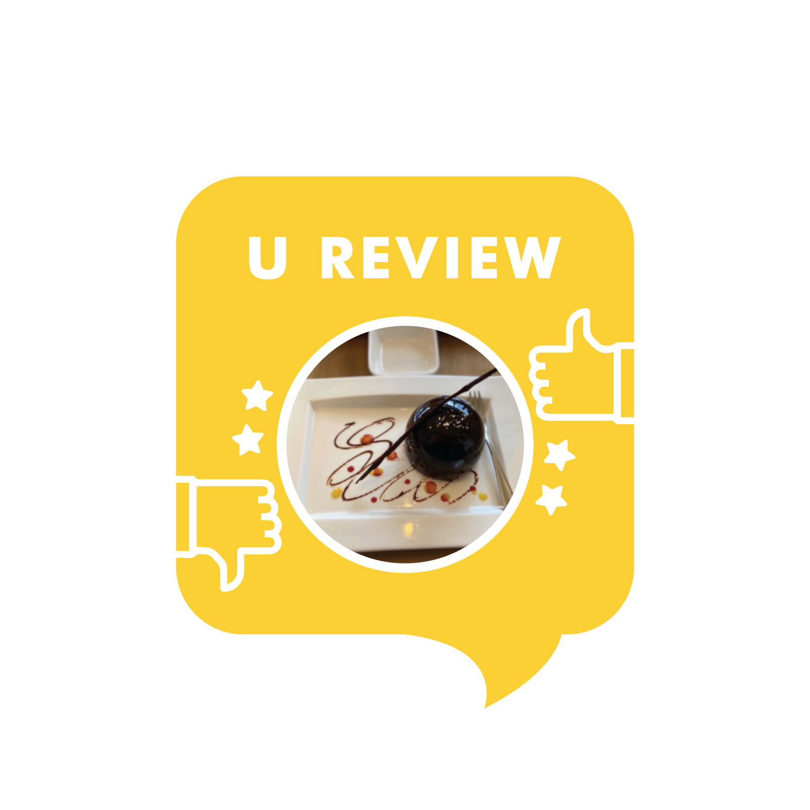

Location: This dessert café is located near the western edge of the Changcheon Culture Park, right below Changseo Elementary School. It’s about a 10-minute walk from the Main Gate of Sinchon Campus.

**Good**

* MOLLIS offers the most delightful desserts with beautiful plating. They are so elegant you’ll be taking tons of photos even before taking the first bite.
* Run by a pâtissier who has also been introduced on TV programs, MOLLIS has the most delicious cakes and chocolates. Their chocolate desserts are milky and delectable while not being too overwhelmingly sweet.
* The place is quiet and cozy, so it is a nice spot to visit with your loved ones for intimate chats and tasty treats.

**Meh**

* There is some distance from the Main Gate, especially compared to other franchise cafés right near the campus or the Main Street Yonsei-ro. But believe me, it will be worth the walk.
* The menus at MOLLIS have a unique taste. So if you’re a fan of traditional, sweet desserts with sugary taste, you might find MOLLIS not very appealing to you.