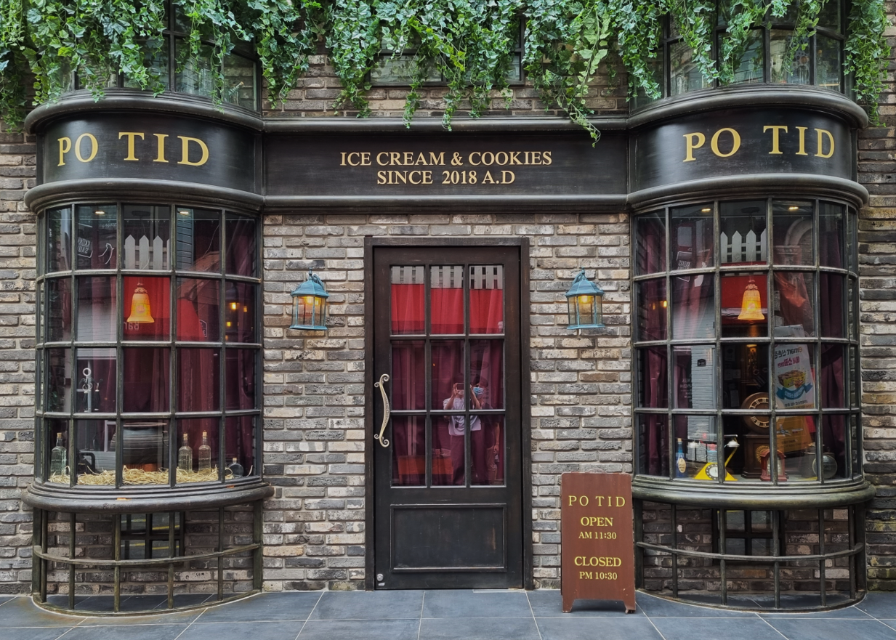

<!--StartFragment-->

Location: Located near Sinchon Dunkin Doughnuts, about 7minute walk from the Yonsei main gate. It is in a very small alley in Myungmul Street—which makes it quite hard to find—so make sure to check out the map!

Good:

* If you are a Harry Potter fan, Potid is definitely worth a visit. The exterior reminds you of ‘Diagon Alley’ from the movie series, and the interior is filled with delicate British props. You will find plenty of Harry Potter references, from the Marauder’s Map to Harry’s attic underneath the stairs. Even the background music is from Harry Potter movies.
* Delicious cookies – you can enjoy warm, soft cookies at a relatively cheap price (4,000 won for each). Double-chocolate cookies and macadamia nut cookies are some of my personal favorites.
* The place itself is photogenic. Every spot (even the bathroom) is perfect for a photoshoot.

Meh

* While the interior is full of fantastic props and furniture, the drinks (americano, café latte, etc.) are relatively plain. The whole experience could be better if they add fantasy in drinks as well!

<!--EndFragment-->