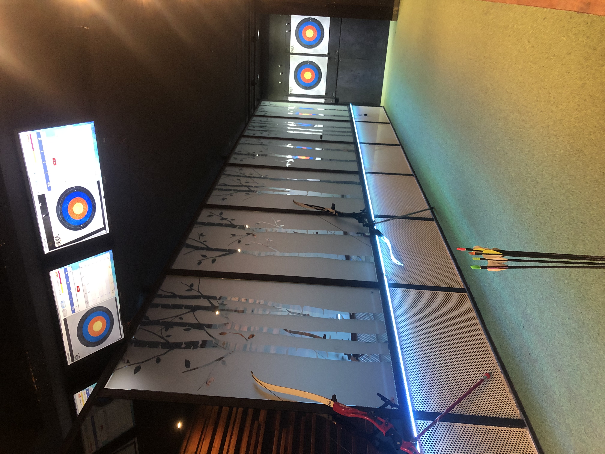

**Good:**

* Tired of hanging out at restaurants, cafes, and noraebangs all the time? Go shoot some arrows! Sinchon Robinhood is the perfect place to try something new with your friends! Archery is quite fun, no matter how unathletic you are. 
* The staff is friendly and patient. You can get quality lessons if you are a beginner. They will teach you from step zero - from having a good posture and holding the bow properly, to aiming and shooting, until you become good at it! 
* It’s only seven minutes away from Yonsei University’s main gate.

**Meh:**

* You may not get along with the owner if you hate IU. You’ll understand what I’m talking about if you ever go, hahah.
* It may be a bit pricey to go on a regular basis. You will spend at least 12,000 won if you are not a beginner (though this includes drinks and unlimited shooting if there is no waiting line).
* You might wake up sore the next day, the bow is kind of heavy.

<!--EndFragment-->