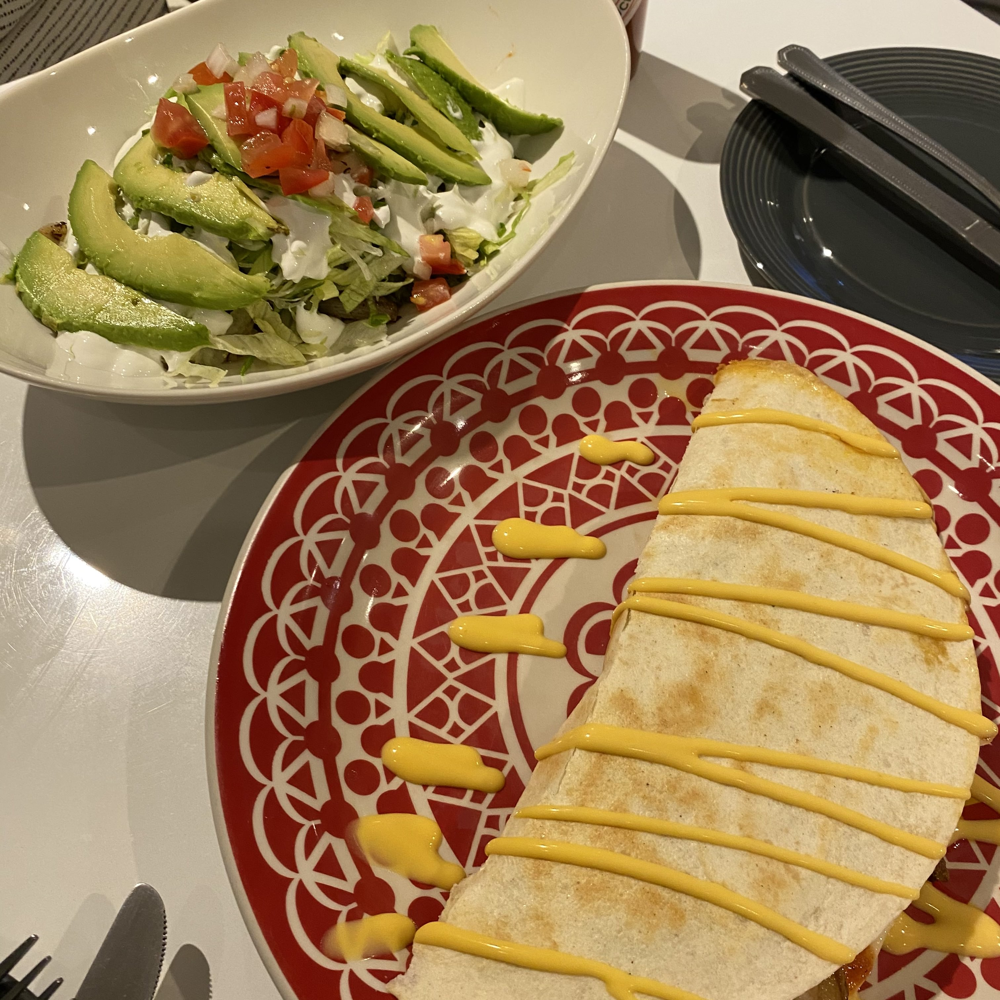

<!--StartFragment-->

Location: Somewhere in the labyrinths of Sinchon

Good

\- Taco Loco offers a wide selection of Tex-Mex cuisine ranging from tacos and quesadillas to enchiladas and chimichangas. They also sell beer, tequila, and cocktails.

\- All menus are under ₩10,000 – perfect for college students on a budget! The tacos are actually cheaper than the ones you get at Taco Bell.

\- Recently, the restaurant moved across the street to a newer open-air location. Highly recommend this place if you are looking to grab an affordable bite in a well-ventilated space!

Bad

\- Cheese aficionados may be offended by the artificial nacho “cheese” drizzled on the quesadillas.

\- The strong aroma of charred fish tends to waft in from a busy Korean restaurant across the alley. Depending on your fondness of fish, this may be a bit unappetizing.

<!--EndFragment-->