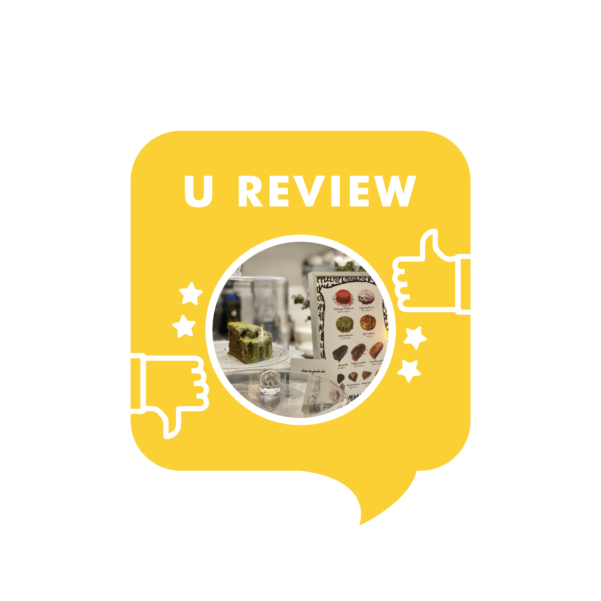

Location: about 10 min from the East Gate of the Yonsei Sinchon Campus, next to the Sinchon Train Station and Ewha Women’s University Campus

**Good**

* Veganique has so many delicious cake flavors - you can pick from rich chocolate, apple or plum. You should also try the decadent brownies or pound cakes, or just sit down with a cup of warming cappuccino. Veganique Milk Tea is also a very popular choice, available in a handy glass bottle to go as well.
* The amazing thing about Veganique is that everything they offer is completely free of any animal ingredients and thus suitable for anyone, but even those not looking for vegan desserts can surely find a new favorite amongst the freshly baked delicacies.
* The interior of the café is quite simple but evokes a relaxing atmosphere and is great for both individuals and small groups. The owners are also extremely friendly, helping to make any visit to Veganique a true healing experience!

**Meh**

* There is almost nothing to critique but if you come later in the day, a lot of the baked goods may be sold out. So I’d recommend coming early.