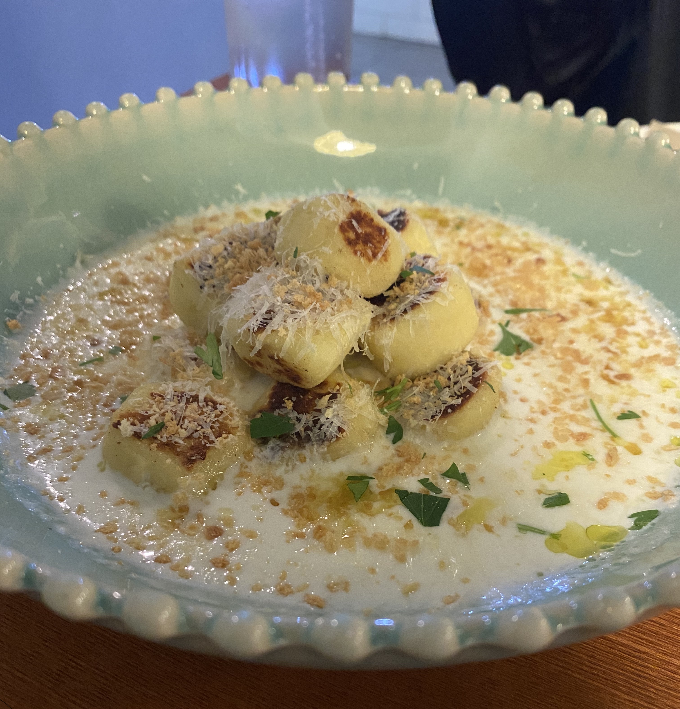

<!--StartFragment-->

Location: The pasta place is a five-minute walk from the main gate of the Sinchon International Campus. To get to the place, just cross the street from the school main gate and go straight. Turn right when seeing the first Olive Young store to your right. Immediately turn left at the next block and go straight. The pasta place should be at your right-hand side on the second floor!

**Good:**

* It is only a five-minute walk from school.
* The atmosphere is very fancy and classy. However, ‘classy’ here does not mean an overly fancy, expensive restaurant atmosphere. This place is worth going only for its casual yet classy and quiet atmosphere.
* There is a wide range of food to choose from. Served food range from various types of pasta to lasagna for main dishes to crème brulée for dessert.
* The place sells gnocchi, a plate which is hard to spot in restaurants near the Sinchon school campus.
* Overall, the plates are very savory. Especially try out the truffle gnocchi and the truffle pasta; they are delicious and are not too heavy to eat.

**Meh:**

* The price is quite expensive and lacks cost-effectiveness for university students. Main dishes are around 14.0~15.0 won, and only serve the exact amount of one serving. Students should not expect cost-effectiveness when visiting this place.
* The restaurant is small in size, with around 5-6 tables. It might be difficult to grab a place during busy hours.

If you are searching for a quiet, classy restaurant serving delicious Italian food near the Sinchon campus, this is the exact place you are searching for!

<!--EndFragment-->