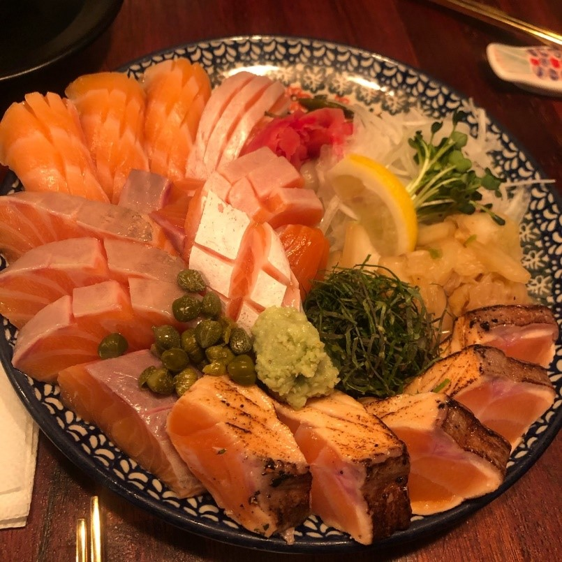

<!--StartFragment-->

Location: Near Hongdae Station Exit 3. It's difficult to explain, so here's a link to a map: <http://naver.me/xcKJAi5u>

**Good:**

* The restaurant specializes in salmon sushi and sashimi. Since it solely focuses on salmon, the quality is guaranteed.
* It has a variety of dishes that include salmon. Other than the typical sushi and sashimi, there are also salads, risotto, and even cooked salmon head!
* One of the freshest fish I have tasted. Cut into big chunks, the fish felt as if it was just caught.

**Meh:**

* The store gets packed due to its popularity and small size.
* There is almost always a waiting time(Last time, I waited in a nearby cafe for an hour).

<!--EndFragment-->