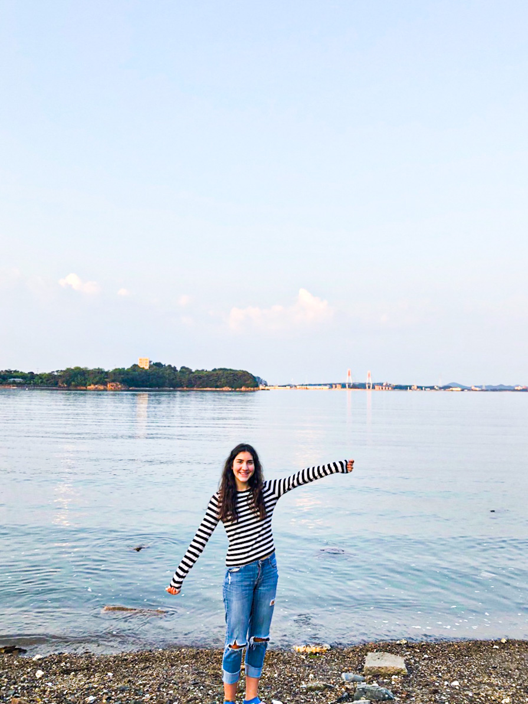

An interview with Amanda Tresca, from the Underwood Division, Class of 21.5. Amanda is a prospective major in Political Science & International Relations and Culture Design Management. Before coming to Yonsei University, Amanda spent her Summer of 2019 with a host-family in Korea through the NSLIY program. Amanda is back in Korea, exploring the ups-and-downs of life away from home.

**How has your second visit to Korea and the independence of dorm-life changed you?**

I learned that I am good at being in my own company. I have begun to ride the subway just for fun. I chill, look out, and get off at a random stop. There is comfort in having people around you, and subways provide that. I realize that everyone is living their own lives, and in a way, it makes me feel less lonely. I have also learned to appreciate the smaller things. While riding the subway the other day, I went to Shin-po, an older neighborhood one stop before Incheon. I visited one of the oldest candy stores of that neighborhood – generations of history unfolded as I stepped in. In this second visit, I am understanding Korea on a deeper level. During NSLIY, everything was so scheduled that I did not get to be independent. But now, I am alone, which enables me to branch out more.

**What do you look most forward to about your prospective majors?**

The reason why I am attracted to PSIR and CDM is because I am interested in working in global marketing. Currently, with technology and media, global communications and marketing are everywhere. However, I don’t think everyone in this field cares to learn about where they are marketing – that is, they lack a cultural and historical sensitivity. Through PSIR I want to learn about the history of international relations and apply this knowledge through CDM.

**If you were given the power to change one thing about the world, what would you choose?**

I would choose to change people’s disregard towards living things – plants, animals, and other humans. Everyone has selfish desires, which is not always a bad thing. But I think improving the level of this regard is crucial because it is always the smallest things that make the biggest impact. For instance, practicing moderated plastic use or putting in the effort to establish meaningful friendships. If I had the power to make everyone in the world care a little more, other problems could be better solved.