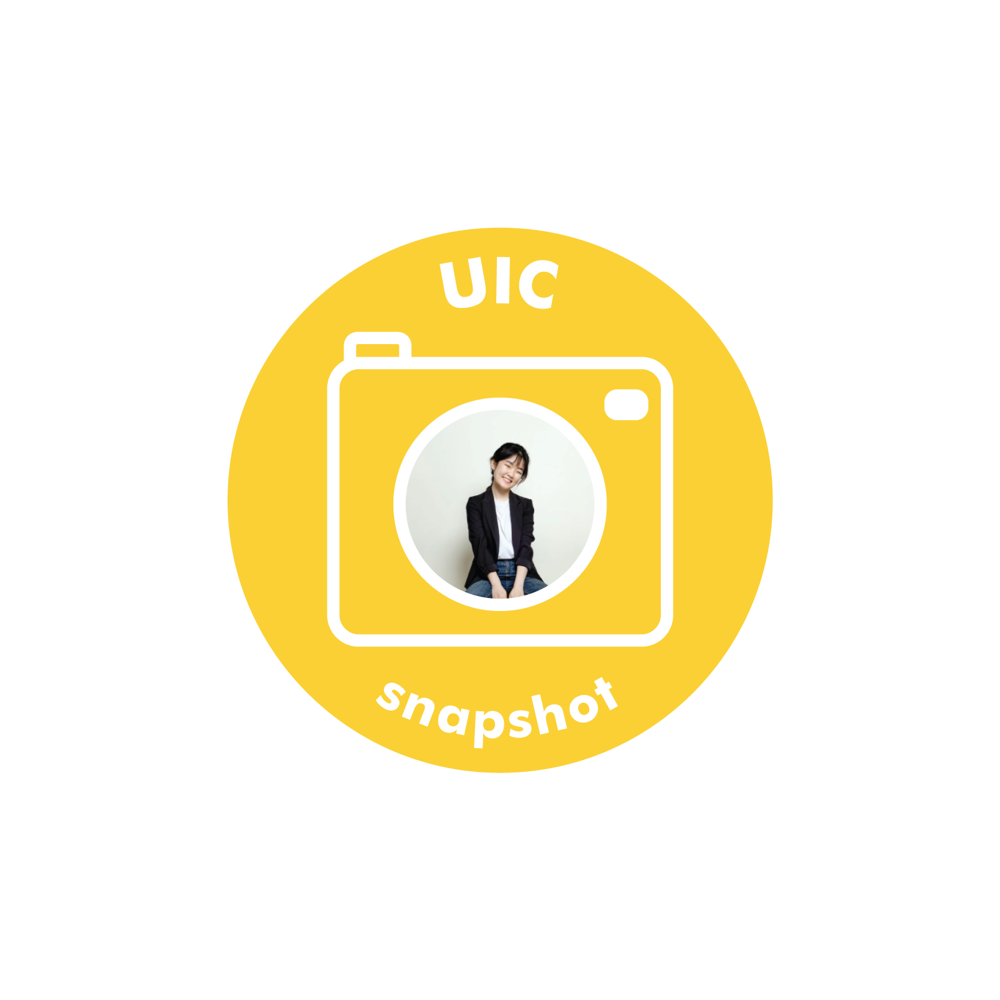

Interview with Daeun Hwang, Information and Interaction Design major from the class of 2018.

**Could you introduce and explain to us about the project you are working on?**

It was a project from the IID ME course “Smart Things: IoT”, where we were tasked to design and build a smart home device. I collaborated with two other teammates, Mary and Denise. We eventually came up with “Sbin”, which is a rotating, trash-classifying smart bin, and we had an opportunity to present a thesis paper at the Korea Society of Design Science.

**What was the inspiration for the project?**

We noticed how trash classification can be confusing at times due to the variety of trash and different sets of regulations according to each type. So our focus was to design a smart device that can facilitate the classification process and even make it interactive and fun!

**What was the most difficult part of the project?**

The most challenging part was that we had to create this product from scratch. None of us had any previous experience with Arduino, which is a necessary software to operate proximity sensors and the stepper motor. Still, my awesome teammates and I managed to pull through by clearly dividing the work--into designing 3D printing, designing overall blueprint and programming--and fulfilling each of our assigned duties. Then at the end, we all pieced these parts together.