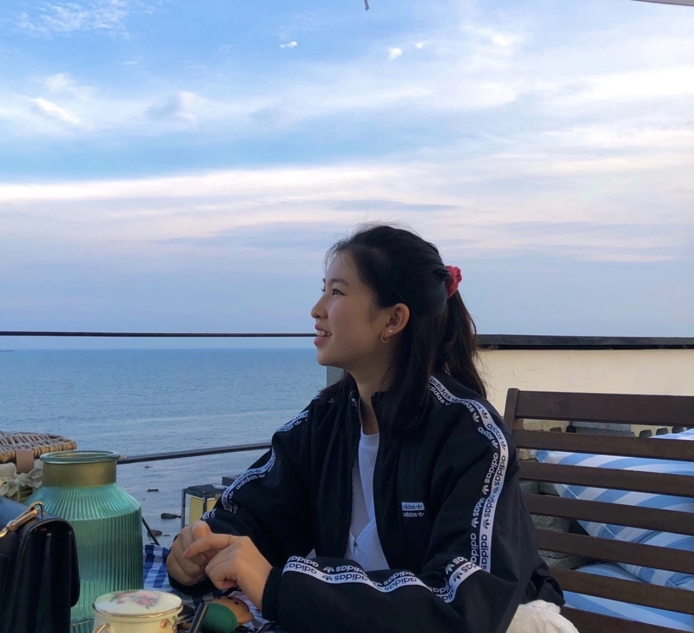

<!--StartFragment-->

An interview with Hanul Lee, International Relations Class of 2019.5

**What is your favorite thing to read?**

“I don’t know if this counts but instead of books I prefer reading Webtoons. My favorite genre is romance-fantasy because I usually love the really detailed costumes of the characters and it just makes me feel like I am daydreaming. The drawings keep me from getting bored and allow me to get really immersed into the story”

**What has been your favorite in school?**

“ It would have to be in my first semester of freshman year, my friends and I ditched our classes and went to Wolmido for the day. We were on the bus and suddenly a bunch of high-schoolers got on. When the bus came to our stop, there were so many high-schoolers blocking the way and only three of us could get off before the driver started to leave. It was total chaos and when we finally got there, nobody was there except for us since it was freezing cold in the middle of winter. The only ride that was open was the Viking and I remember how we kept laughing at each other’s faces.”

**What sauce would you be?**

“Chamoy because I’m sweet and spicy. Also, I am from Mexico and I really love eating Chamoy with beer and mango.”

<!--EndFragment-->