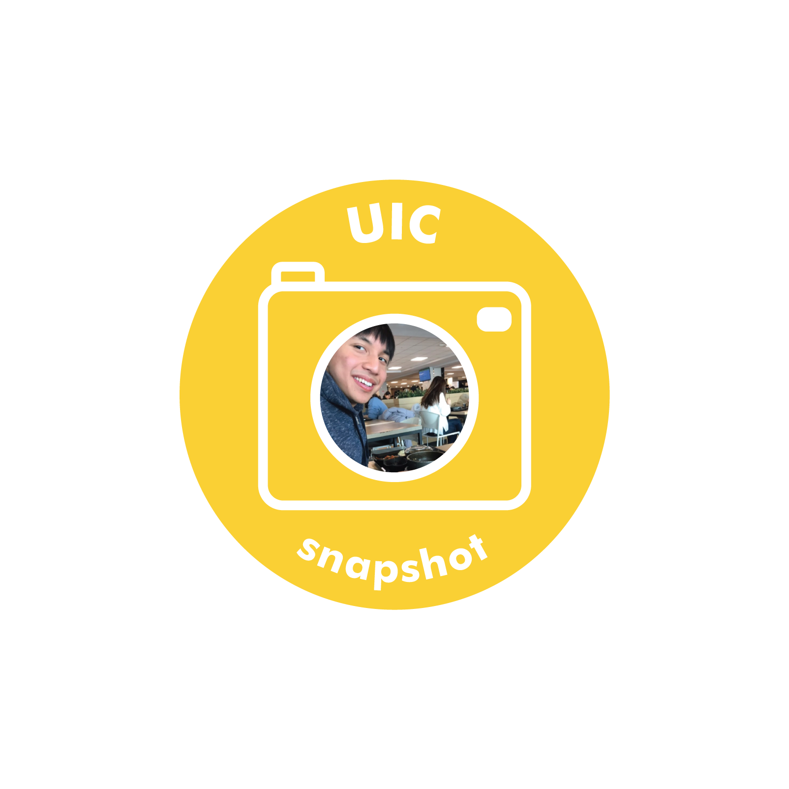

Interview with Hein Htet Aung, Energy and Environmental of Science and Engineering (EESC) major from the class of 2019.

**What would be the most important virtue?**

I think patience helps solve problems with most people. We should give enough time to others to understand their thoughts and opinions. I want to make sure I can listen more closely to others without being rash.

**What was a vacation that you enjoyed?**

I visited Myanmar and stayed with my friends for a vacation during high school. One thing I miss is a dish called Biryani. It is made with yellow rice and chicken along with a lot of spices. It is hard to find a restaurant that serves it in Korea.

**What is a country you would like to visit?**

Switzerland. It is a place I would like to go as an exchange student. The country has many beautiful landscapes with peaceful atmospheres. I would also like to try their famous chocolates, since they are also known for them.