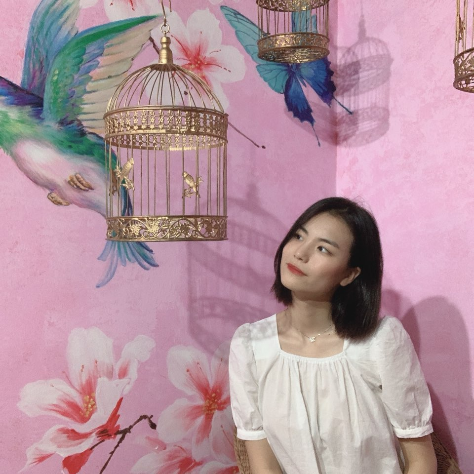

Interview with Hojeong Chang, International Studies major, Class of 2019

**If you could travel in time, where/when would you go?**

If I had the chance, I'd like to go back in time to when my parents first met. I occasionally hear about my mom and dad's love story and how they got married. I always wondered what they were like when they were my age. I really enjoyed watching the film "Back to the future," which is about the protagonist going back in time when his parents first met and fell in love. It would be fun to watch my parents' university life and how they first met each other.

**What extracurricular activity are you taking part in, and what do you enjoy about it the most?**

I am currently in a film-making club where we produce various kinds of videos, including short films, music videos, dramas, and documentaries. One thing I really like about this club is that I get to meet people from various universities and majors. From this, I was able to step out of my comfort zone and widen my perspective to meet new people who share the same interest and passion in film-making as me.

**What is the first thing that you want to do at Sinchon Campus when Covid-19 is over?**

I would love to just walk around Sinchon Campus with my friends and take pictures. Sinchon Campus has many famous photo sites and the view is amazing, so I would love to take pictures and make memories with my friends.