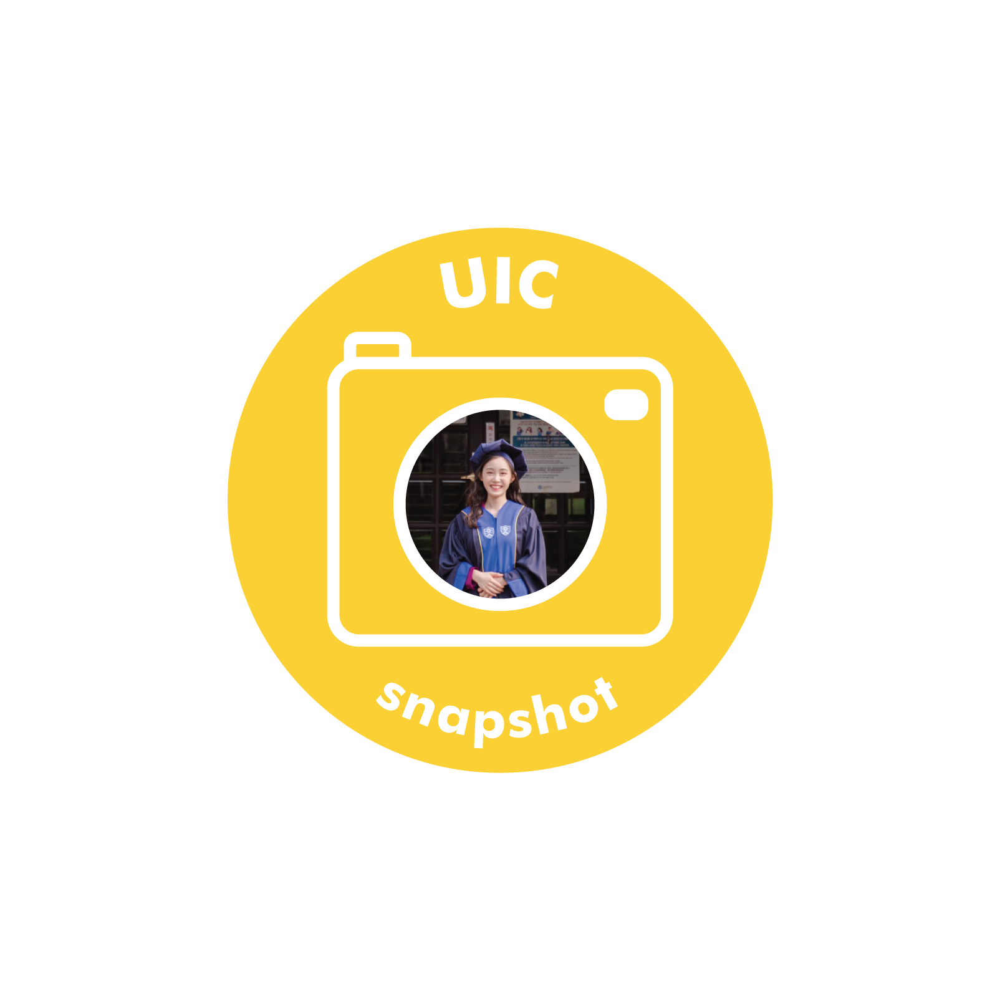

Jinny Kim is a class of 17, double majoring in International Studies and Communications. She is a hardworking student, and always opened to new experiences. Jinny participated in Yonsei’s exchange program to the University of Copenhagen, where she was able to gain various insights on international businesses. During her time at Yonsei, she had been the Marketing Manager at Yonhee Town Businessmen and the Keyboard Session at Hwalchun.

**Why did you choose to come to UIC?**

I chose UIC because I wanted to leverage my global experience of having lived abroad in the US and having graduated from a foreign language high school. I was attracted to UIC because it is an all-English learning environment with students from diverse backgrounds. I am satisfied with my choice so far, since I was able to strengthen my speaking/writing abilities and meet so many talented people along the way.

**What are you most interested in these days?**

I have to say BTS :) I love the message they are spreading around the world during these hard times. Watching their videos is a real pick-me-up for me these days.

**What are your plans after graduation?**

I've recently finished my last(!) semester at Yonsei. I am interested in global marketing, so I plan to go on field work such as internships, competitions and supporters programs, to grasp what I would really like to do. I finished my school years without taking a semester off, so I haven't had enough time for these extracurricular activities, and now, I’m looking forward to an adventure. Wish me luck :)