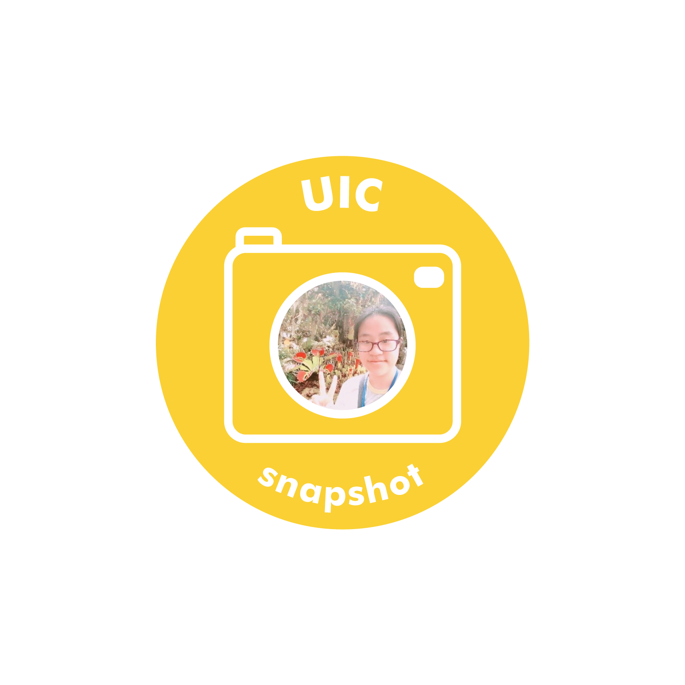

Interview with Juhyun Park, who started in the spring of 2020. HASS division, major undecided.

**What are you planning on majoring in your sophomore year, and why?**

I’m planning on majoring in Culture and Design Management (CDM). So many products that are both practical and creative in their design are being marketed these days. My dream is to plan my own such products, which is why I’ve decided to learn about media and design. So my goal in high school was to apply for the Techno-Art Division (TAD) after entering HASS. After enrollment, I found out that TAD is divided into three majors: Information and Interaction Design (IID), Creative Technology Management (CTM) and Culture and Design Management (CDM). I prefer CDM because it seemed more flexible in its application to a variety of careers.

**What’s your favorite class this semester and what do you like about it?**

My favorite class this semester is professor Park Sunghee’s Freshman Writing Intensive Seminar. I like how the lectures are centered around analyzing famous literary texts such as Shakespeare and Margaret Atwood from racial and gender perspectives. The interaction we have with students and the professor through discussions is also pretty active, which is perfect for me since I like participating in class.

**We’re all more or less suffering from Corona Blue these days. What song would you recommend to comfort someone or lift up their spirits?**

I want to recommend A_Hisa-Butterfly. It’s really exciting and fast, and it will make your shoulders jump up and down as you listen. Just turn up the volume real loud and dance however you want. It would instantly lift up your mood!