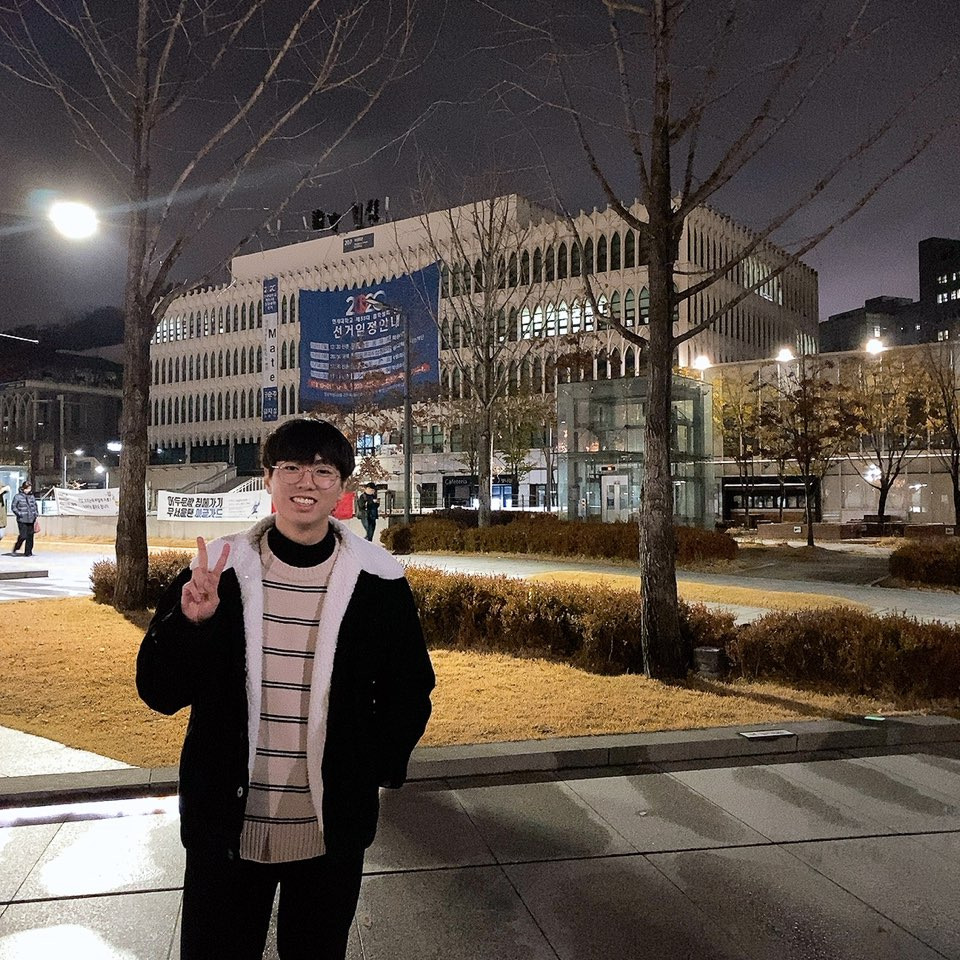

<!--StartFragment-->

Interview with Jungyeop Shin, Economics major from class of 2019.

**What's the best thing you did after taking a leave of absence?**

Amongst the many memories I've made, taking a trip to Wando was the best. I was actually having a busy life with all the courses and school activities last year, and travelling to a quiet place helped me lighten up. The soft waves and calm breeze made me forget all my worries. I especially miss the food there :(

**How's work at school? What do you do?**

Well… work is always tough. I assist exchange student and summer school programs in our school. The calls and emails piled up always leave me in despair, but assisting students and fellow workers is somewhat rewarding. I was actually supposed to quit my job this week but am stuck here because there are no applicants for my place. Anybody reading this, please apply for Yonsei OIA…

**Weekends must be like gold to you..any exciting plans this month?**

I should definitely cut down alcohol. My golden weekend is full of drinking. Other than that, I’m planning to quit my work at school and travel to Gunsan for a few days. It’s a privilege for students on a leave of absence. Of course, alcohol will be part of the journey as usual…

<!--EndFragment-->