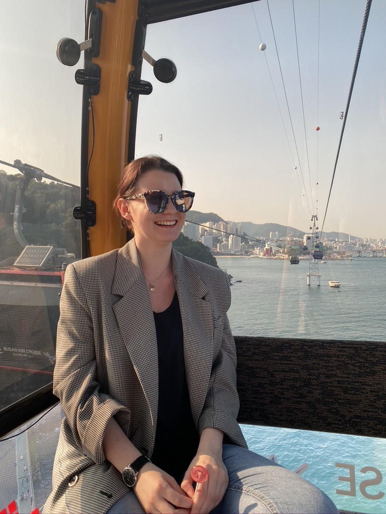

An interview with Larissa Albrecht, a rising junior in the Political Science and International Relations (PSIR) major. Larissa is originally from Switzerland and in the past year, has been engrossed as an active member and now president of her major’s Emergency Exigency Committee.

**1. What is something you are excited to do as the president of the PSIR Emergency Exigency Committee?**

What I am most excited about in this new role is to be able to work together with amazing people who have the same drive and passion as I have to better the experiences of each student in our major. The committee members are so diverse and bring such a variety of perspectives to the table, so I am constantly inspired by their ideas and work ethic.

**2. What is the reason you were drawn to choose your major?**

I always had a key interest in the global flow of politics and human capital, and I wanted to take part in the behind-the-scenes of such issues via policy changes. Additionally, I have a passion for teaching and sharing my knowledge with the younger generations. I knew that through this major, I would have the option of going down the path of higher education. 

**3. If you had all the money and resources available, what is something that you would change about the world?**

I would focus on fostering a culture of equality and bettering the balance of how the natural resources of Earth are divided.