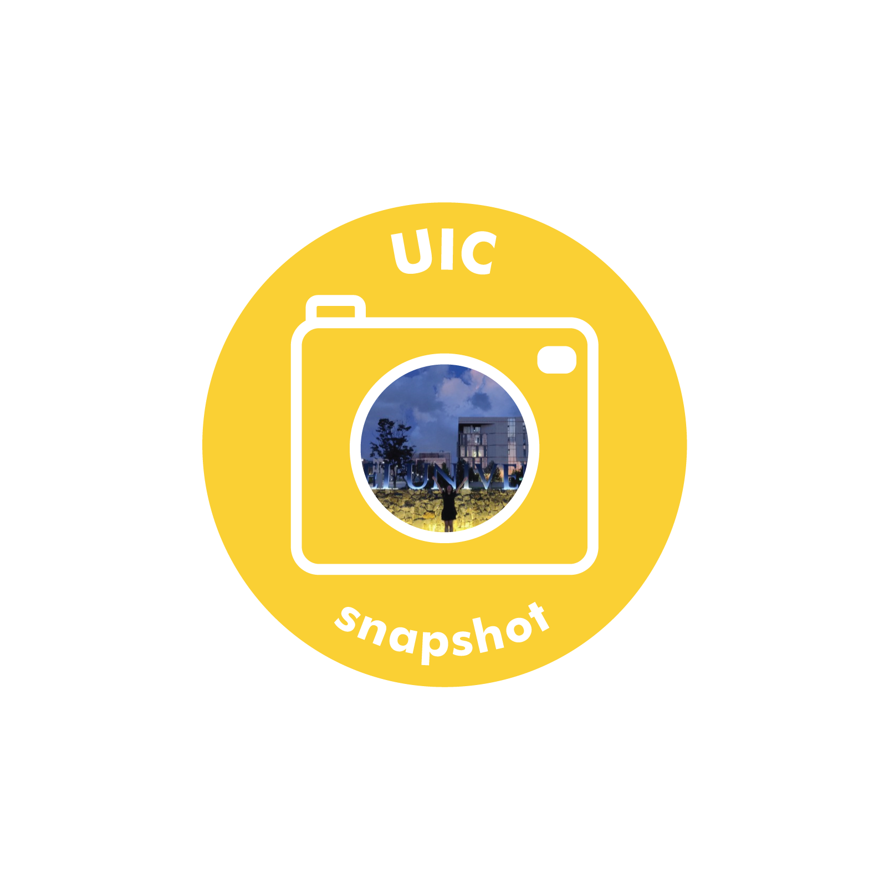

Interview with Min Yu Koh, who started in the fall of 2019. HAAS division, Asian Studies.

**What is your typical day in college?**

I usually start off my day doing light yoga stretches or meditation before I wash up and eat breakfast. Depending on my breaks, I will prep for classes or just chill before the next class starts. Once or twice a week, I will make sure to go out and cycle or jog to keep myself sane. Usually I will have to rush back in time for a club meeting in the evening before I prep for classes the next day.

**Have you tried to study Korean? Is it hard?**

I am currently taking a Korean class. I think it is relatively easy to start and learn Hangul, but it gets challenging to keep up with trendy words if you don’t practice speaking.

**What’s a hobby that you love? How did you fall in love with it?**

I love cycling! My love for cycling was actually rekindled at Songdo Campus. I used to cycle with my friends around Songdo very often. I got to see more places with the power of my own 2 feet on the pedal.