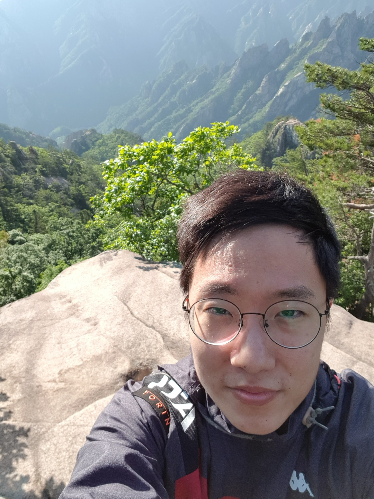

<!--StartFragment-->

Interview with Moses Park, Life Science and Biotechnology major, who started in the fall of 2018. Moses has just completed his mandatory military service as a Republic of Korea Marine.

**What do you think is the biggest difficulty students returning from military service face?**

I think the biggest difficulty is readjusting to everything you have missed or have been missing—like your studies or friends. While you have been away, people have been socializing, and it is not as easy to insert yourself into the group again as before. Your classmates have moved up the ladder while you return to the bottom with a large loss of memory and motivation. You are grouped there with your juniors who are bound to have a clearer grasp on the subjects. It is time to forget everything military and relearn life at school—starting from saying hello.

**What did you miss most about the school?**

Listening to professors. It is always great to listen to those who have put their hearts into their lectures, though it concerns me that classes have been moved to Zoom. I do not think it will ever be able to recreate that distinct feeling of being in a classroom while the air conditioner sends shivers down your neck because you have chosen the wrong seat. I hope to see my professors again. I knew they were great, but now I know it even better.

**If given a chance to have dinner with any person (living/dead), who would you choose and why?**

I would love to have dinner with Garrett or Nat, or Noah, or Ray, or Joshua, etc. You would not know them; they are my friends who live abroad. If it were not for Covid, we would have met. Famous, influential people? They are great but sorry— I am not very good with strangers. I will read about you in a book. My friends? I will see you on Discord for now. May we eat dinner together someday.

<!--EndFragment-->