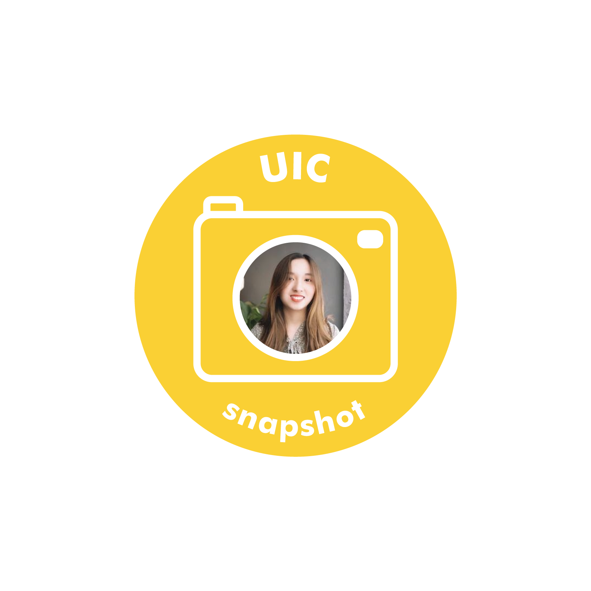

Interview with Nguyen Van Anh, a junior majoring in Creative Technology and Management.

**Your favorite moment so far during your stay in Korea?**

My favorite moment is when I can go to noraebang (Korean karaoke) with my friends, where all of my stress is relieved through singing and shouting.

**Your favorite place to go in Seoul?**

I love going on picnic with my friends by Han riverside. We would order some chicken, enjoy the refreshing air, and admire the beautiful view of the river from dusk to night. The calmness of Han river really soothes my mind after the long stressful days at school.

**Your plans for this winter vacation?**

I plan to go back to my country after almost a year in Korea. Despite the pandemic, this year was actually quite meaningful for me and helped me understand myself much better. So, in winter break, I will continue to seek out new experiences and challenges to further explore myself.