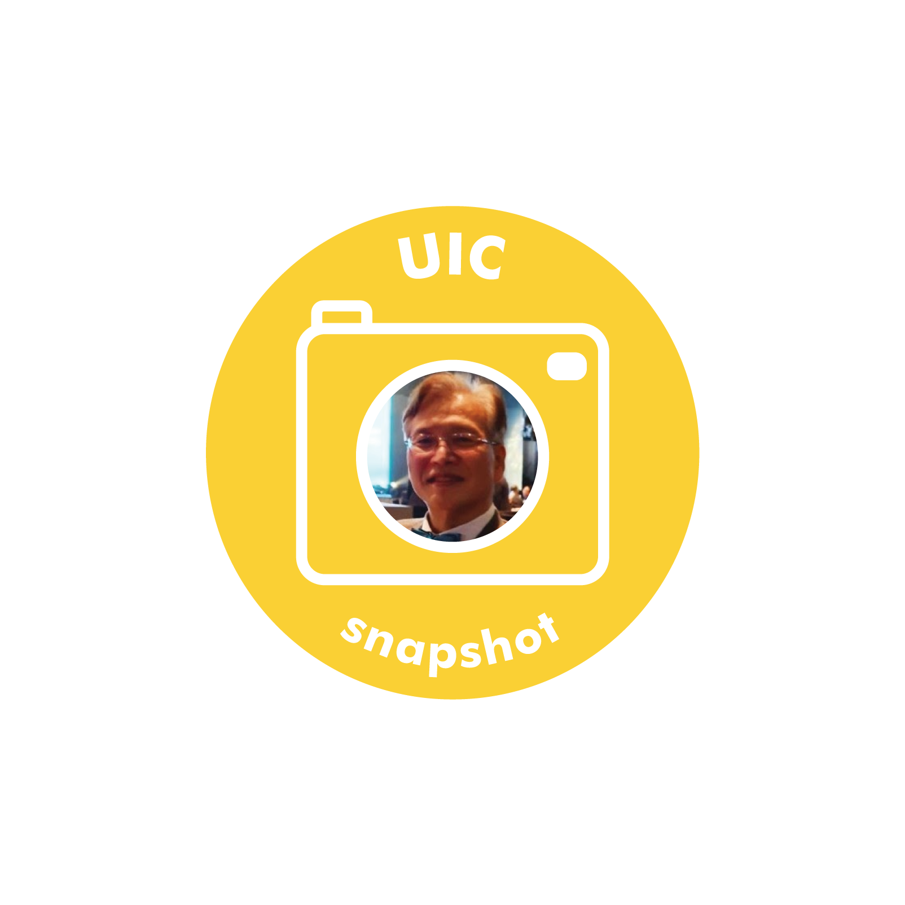

**What is your favorite book or movie?**

My favorite book is "The Art of Loving," written by Erich Fromm. In his book, Erich said, "love is primarily giving, not receiving." To contribute to the neighborhood and all the people around you, you should be a productive character. Giving is the highest expression of potency. In the very act of giving, you experience your strength, your wealth, your power. This experience of heightened vitality and potency fills you with joy.

My favorite movie is "Love Story," which has been aired once in a while since its release in 1971.

I still love to listen to the theme, “Where Do I Begin.” It reminds me of some memories related to the Sinchon campus back in the 1970s.

**Who would you recommend to study economics?**

I'd like to ask every single Yonsei student to study economics because it'll give them the wisdom they need to understand human behavior and society. Furthermore, if you want to be a leader someday, you desperately need it. If you lack economic knowledge, it'll be difficult for you to make any meaningful decision.

**What is your favorite meal to have?**

I love steamed crab. Especially at the seaside restaurant near Songdo campus.