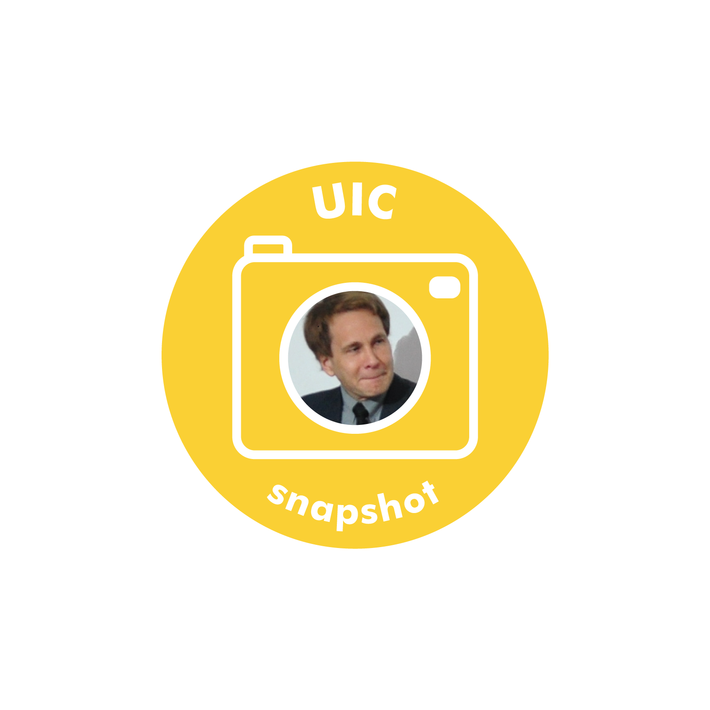

Interview with Professor Joe Phillips from the Justice and Civil Leadership (JCL) Program

**What aspect(s) of South Korean culture do you find unique or interesting?**

I find most interesting the residual ‘Confucian’ mentality in personal and social behavior mixed with increasing Liberal individualistic values. I do not mean ritualistic Confucian practices but a communal approach to socio-economic issues, emphasizing ‘fairness’ in how society’s members are treated and expecting civility in personal dealings. ‘Communalism’ has a negative side — suppressing individuality, which conflicts with hegemonic concepts of proper behavior, claims to rights, etc. This suppressive communal thinking existed in the West but, over centuries, eroded before Liberal individualism in the market, social, and personal arenas. South Korea seems to be trying to navigate — socially, politically, and legally — between the two paths.

**How do you like to spend your free time?**

Sleep.

**What do you think is the most pressing social justice issue in our society today and why?**

While I cannot identify a single, most pressing issue, I am concerned about the illiberal trends in Western democracies undermining free speech and vigorous public discourse. Liberals have historically argued for respecting citizens’ negative liberties (freedom from arbitrary power and interference from others) and nurturing positive liberties (capacity and opportunity) to promote critical, evidence-based discourse. However, a recent, influential, left-wing narrative argues that certain views, groups, and even individuals do not deserve a place in our public forum. We saw this paradigm in the United States during the 1950s when right-wing anti-communist nationalists restricted the free speech of liberal, left-wing, and communist advocates. Ironically, today, a left-wing, Manichean narrative punishes speech that is deemed too supportive of historic oppressors or insufficiently protective of historic victims. In the U.S., this plays out in the marketplace and society where ‘unacceptable’ views and those espousing them are ‘canceled.’ In Western Europe, these speech limitations are also incorporated into laws.

South Korea is a mixed bag. Free speech is largely intact and expanding with increased freedom to advocate positive, conciliatory opinions and policies regarding North Korea. But, South Korea’s most notable free speech fails with regards to the colonial era under Japanese rule. Arguments that challenge the hegemonic narrative on ‘comfort women’ and other aspects of Japan’s occupation of Korea are punished socially and legally. As with all discourse restrictions, this has undermined knowledge, promoted dogma, and caused real harm to those offering alternative views or merely opening the dominant narrative for debate. In South Korea’s case, it also negatively impacts international relations.

**Do you think free speech should hold regardless of the content? What are your thoughts on hate speech, for example?**

Even the most ardent free speech advocates accept some content restrictions, for example, prohibitions against fraud, defamation, and speech that is likely to produce imminent physical dangers. What these cases have in common are fairly clear criteria for violation and injury, and a consensus on prohibiting them. 'Hate speech' has none of those, which makes it, in my opinion, a subjective, dangerous, even authoritarian philosophy. I am open to arguments by 'hate speech' defenders, such as Jeremy Waldron, who attempt to address these problems. But, as yet, I am not convinced.