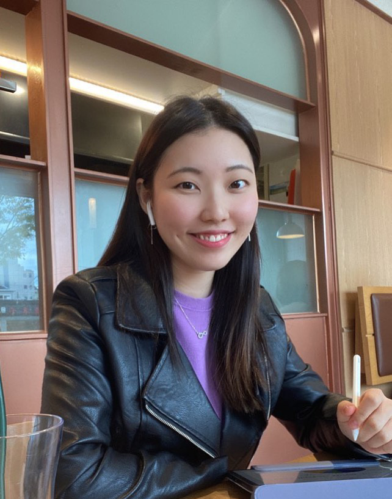

Interview with Seoyeon Park, Economics major, Class of 2020.

**Would you consider yourself a believer in fate?**

I honestly can’t say for sure if I am a believer in fate or not. I don’t believe in fate theories or the concept of people having their futures determined from birth. Rather, I think one makes one’s own fate. However, at the same time, I do think there might be something beyond your free-will in your life, because certain circumstances or certain people you meet along your life journey is not something you can choose. People of the 21st century might have lived a completely different life if it weren’t for COVID-19, but if, by any chance, one has made some critical life decisions that he might not have made because of this pandemic, maybe that was his fate after all.

**As "Class of Corona," how have you been holding up for the last few semesters?**

I would be lying if I said it was okay. I definitely had better days in my life, and I admit – it was quite hard. I struggled with covid-blue and loneliness, which struck me regardless of the number of friends I had. But looking back now, I think it was a precious time in my life where I got the chance to get to know myself better and be reminded of the importance of the people around me. Now, I can confidently say I’ve perfectly adapted to this new norm and am living a very wholesome, busy life!

**If your life was a movie, what genre(s) would it be?**

Comedy. My life is pretty fun, and I find myself laughing all the time. It’s not because I’m doing something really interesting or fun all the time. In fact, my lifestyle pattern is pretty mundane, but the people around me and the conversations we share put a smile onto my face whenever I think back on them. Laughter out of the ordinary – I think this is pure comedy.