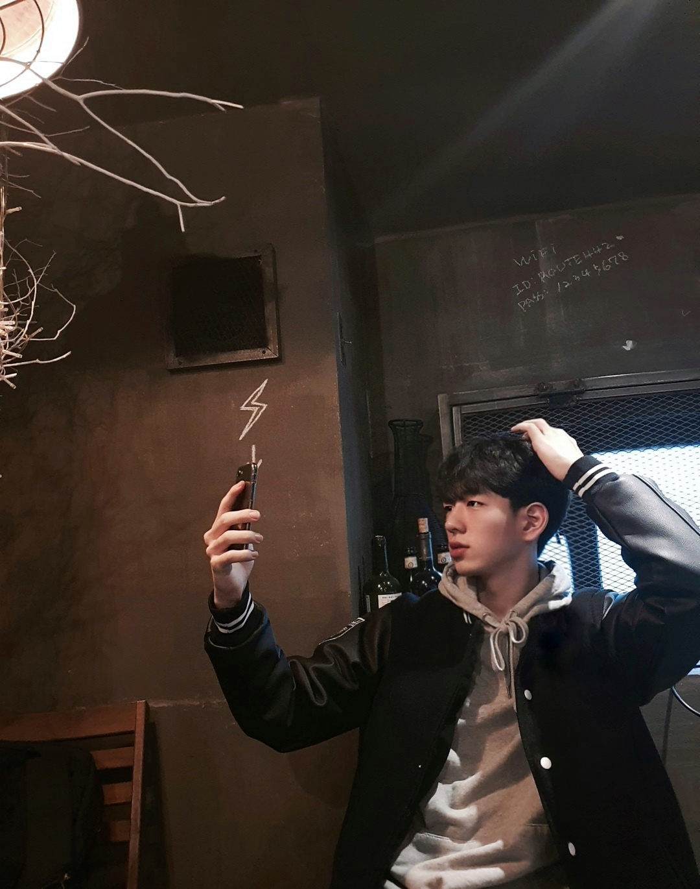

<!--StartFragment-->

Interview with Seungheon Lee, Life Science and Biotechnology student, Class of 2020.

**What is your main personal philosophy in life?**

My main personal philosophy is to accept my imperfectness. I used to put myself under pressure when making certain decisions because I hated the regret I might face, which irritates me and ruins my day. Yet, I felt that with this attitude, regret always follows regardless of choice. Thus, I learned that I cannot make the ‘perfect’ decision every time. Instead, I now focus on learning from mistakes and avoiding making the same ones again.

**What is one UIC event the class of 20 missed which would have improved our school experience had we experienced it?**

RC activities would really have helped build a strong sense of community. Due to the pandemic, many students were not able to socialize with their peers, which I believe is the flower of campus life. With RC activities, students would have been able to meet peers from various divisions and delve into their personal interests as well.

**Is there a weird food combination you recommend?**

Vanilla ice cream with sesame oil! The ice cream becomes more flavorful and tastes like caramel and peanut butter.

<!--EndFragment-->